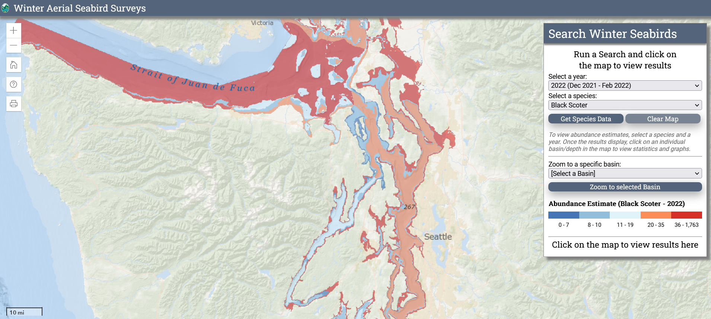

# Welcome data users! {.unnumbered}

The purpose of this workbook is to provide you with a detailed data overview and R script to compile transboundary sea duck datasets for the Salish Sea. This step-by-step guide will walk you through each available data source, how to access the data, and how to compile it into a standardized data format. This resource will also give the user an overview of any limitation, gaps, or considerations when using various dataset. We hope you find this guide useful for you independent and collaborative research endeavors.

```{r coverimage, echo=FALSE, out.width="700px", fig.align='center'}
knitr::include_graphics("images/SalishSea.PNG")
```

*Photo credit: The Oregonian*

<!--chapter:end:index.Rmd-->

---
output:
  pdf_document: default
  html_document: default

---

# Overview {#Intro1}


**Engaging a transboundary expert network to prioritize coastal and marine habitat management for sea ducks in the Salish Sea**

## Project Summary {#Intro1.1}

Sea ducks are an indicator of ecosystem health in the Salish Sea, which is of global importance to many populations of marine birds that use these transboundary waters throughout the annual cycle. It is therefore imperative to work across management jurisdictions to effectively conserve key areas of habitat for these birds. However, jurisdictional complexities often presents a major challenge to taking an ecosystem scale approach to sea duck management, not least because many information sources (i.e., biological datasets) end at the international border. This work aims to overcome this barrier by harmonizing information in a way that assists agencies responsible for implementing conservation prescriptions.

## Goals {#Intro1.2}

This R user guide aims to fulfill one of the key project initiatives: to identify and assess compatibility of avian datasets in the Salish Sea. By the end of this guide, researchers or resources managers interesting in accessing and compiling the available data resources will know:

(1) Which transboundary data resources are available
(2) Who the data owners are and how to access the data with appropriate permissions
(3) How the datasets are structured, including details on the data collection protocols
(4) What the limitations, challenges, and opportunities are associated with each dataset
(5) How to compile the datasets into a standardized data format

> **WARNING: This guide may not provide all the details needed for the specific analysis you are interested in doing. Data users are responsible for understanding the data collection protocols before proceeding. If in doubt, reach out to the data owner with your questions!**

## Scope {#Intro1.3}

There are seemingly endless datasets that live on the hard drive of some retired government biologist computer. Since the goal of this guide to identify *available* data resources, we do not include datasets that are difficult to find, lack well documented metadata, or require complex data permissions. Thus, avian datasets needed to be openly accessible to be included in this guide. Generally, the datasets that are not openly accessible are older (pre 2000) and cover a narrow geographic extents. Because of this, the guide is scoped primarily to data collected post-2000. 

Some additional data resources are detailed in [Chapter 9](#Add) 

## Guide Structure {#Intro1.4}

[Chapters 2-8](#BCCWS2) in this guide are dedicated to detailing each avian dataset separately, and are structure using similar subheadings. The datasets are presented in the following order: Canada, U.S., transboundary. [Chapter 8](#Data8) focuses on compiling the data sources into a standardized framework. [Chapter 10](#Spatial10) is dedicated to spatial data compilation.

## Acknowledgements {#Intro1.5}

A great deal of time and effort have gone into gathering, compiling, and making the data presented in this guide accessible. Data users need to appropriately acknowledge the source of the information they are using. This also should including an acknowledgement of volunteer efforts in instances where data were collected by citizen-scientist.

This project was a collaborative initiative between Birds Canada, Environment and Climate Change Canada, Ducks Unlimited Canada, Pacific Habitat Join Venture, USGS Cooperative Unit, Washing Department of Fish and Wildlife, and Audubon Washington. Funding for this project was provided by ... *others?*

This R User Guide was written by Dr. Danielle Ethier and Dean Evans with Birds Canada. Any comments, edits or suggestions can be sent to [dethier\@birdscanada.org](mailto:dethier@birdscanada.org){.email}. Your feedback is always welcome and appreciated!

<!--chapter:end:01-Intro.Rmd-->

---
output:
  pdf_document: default
  html_document: default

---

# BCCWS {#BCCWS2}

[**British Columbia Coastal Waterbird Survey**]((https://www.birdscanada.org/bird-science/british-columbia-coastal-waterbird-survey))

```{r tidyr2, echo = FALSE, message = FALSE, warning = FALSE}

library(knitr)
opts_chunk$set(tidy.opts=list(width.cutoff=50), tidy = FALSE)

```

```{r image, echo=FALSE, out.width="700px", fig.align='center'}
knitr::include_graphics("images/BCCWS.PNG")
```

## Quick Data Overview {#BCCWS2.1}

| Data        | British Columbia Coastal Waterbird Survey (BCCWS)                                                                                                      |
|--------------------------|----------------------------------------------|
| Owner       | Birds Canada/ Canada Wildlife Service                                                                                                                  |
| Status      | Active                                                                                                                                                 |
| Years       | 1999 - present                                                                                                                                         |
| Seasons     | Monthly survey, with a winter focus from Sept - April                                                                                                  |
| Sampling    | Coastal surveys along designated routes                                                                                                                |
| Data Access | Available directly in R, with permission from Birds Canada or through the [NatureCounts](https://naturecounts.ca/nc/default/searchquery.jsp) webportal |
| Contact     | [rtorrenta\@birdscanada.org](mailto:rtorrenta@birdscanada.org){.email}                                                                                 |

## Data Collection Protocol {#BCCWS2.2}

BCCWS data collection protocol can be found online [here](https://www.birdscanada.org/bird-science/british-columbia-coastal-waterbird-survey/bccws_resources).

In short, surveys have been conducted by volunteers using a standardized protocol and data collection [sheets](https://birdscanada.b-cdn.net/wp-content/uploads/2021/02/BCCWS_Datasheet.pdf). Shore-based counts are completed monthly on or near the second Sunday of each month from September to April. Surveys are complete within approximately 2 hour of high tide to maximize the opportunity for close observation. All waterbirds observed to a distance of 1 km from the high tide line are counted, except those that fly through without stopping. In the case of larger flocks, numbers are estimated by counting individuals and species in groups and scaling up (see [Training Module for Volunteers](https://birdscanada.b-cdn.net/wp-content/uploads/2020/02/BCCWS-Training-Module.pdf)). Data are entered through a customized online data entry system available on the Birds Canada website, [NatureCounts](https://www.birdscanada.%20org/birdmon/default/main.jsp). Observations are processed using the eBird data filters to flag rare species and high counts during observer data entry, and records are manually reviewed for form accuracy.

## Avian Data Collected {#BCCWS2.3}

Observation counts of waterbird and raptor seen during a survey are compiled at the scale of the route (i.e., the maximum count per species) on each monthly survey. These observations are divided into inland, near shore (shoreline to 500m out from high tide), off shore (beyond 500m), and total counts. The dataset is not zero-filled.

Taxonomic Authority = [eBird/Clements v2019](https://www.birds.cornell.edu/clementschecklist?__hstc=60209138.6f747e6e23a2f1b7014cf372ca892894.1544132358313.1566237656917.1566240564794.714&__hssc=60209138.3.1566240564794&__hsfp=2467889448)

## Auxiliary Data Collected {#BCCWS2.4}

-   Observer information: observer ID

-   Survey information: time observation started, time observation ended, duration in hours

-   Survey condition: precipitation, % cloud, sea condition, tide state, tide movement, visibility, survey equipment, human activity (all categorical)

## Data Access, Permission, and Format {#BCCWS2.5}

Data can be freely accessed through the NatureCounts data [download](https://naturecounts.ca/nc/default/searchquery.jsp) portal or directly through the naturecounts R package, which I will demonstrate later in this chapter. The BCCWS is Access Level 4 dataset, meaning a data request form must be submitted. This is not meant to be a barrier, rather a means of keeping track of who is using the data and for what purposes.

Data are formatted using a standardized schema that is a core standard of the [Avian Knowledge Network](https://avianknowledge.net/) and which feeds into [GBIF](https://www.gbif.org/). This format is called the Bird Monitoring Data Exchange ([BMDE](https://naturecounts.ca/nc/default/nc_bmde.jsp)), which includes 169 core fields for capturing all metric and descriptors associated with bird observations.

## Data Use Considerations {#BCCWS2.6}

The data are collected using a standardize protocol, by trained citizen-science volunteers. This standardization is a strength of this datasets for making inferences about coastal waterbirds in the Canadian Salish Sea.

The repeated sampling design of the BCCWS makes this dataset suitable for an occupancy modelling framework, in which the probability of detection can be modeled alongside occupancy. Auxiliary data collected during each survey are suitable for the detection process of the model. Using mean counts in abundance on a route within a year, these data have also been recently used to assess coastal waterbird [trends](https://www.ace-eco.org/vol15/iss2/art20/).

Measures of effort are innate to the dataset. Survey duration (column `DurationinHours`) and survey area can be used to make effort correction to counts. Survey areas for each survey route has been provided as a .shp file in the `Data` folder in this project directory. The number of years an observer has been doing the survey can also be used to correct for observer bias.

There is spatial inbalance in the sampling design, with more routes occurring in the southern Salish Sea and around areas that are inhabited by people. Hard to access locations are no well sampled, nor are regions further to the north. Since this survey is shore-based, there will be a species sampling bias. Specifically, birds that use near shore habitats will be detected and counted more often than birds which use offshore habitats. This dataset may therefore be less suitable for modelling at-sea habitat use, for example.

The dataset should be filtered prior to use. For example, rare species should be removed since they are not necessarily representative (e.g., those which occur on \<1% of routes). Depending on the analysis, routes that are run for only a short time (e.g., \<3 years) or which have incomplete data (e.g., \<8 months per year or \<4 core winter month) may be considered for removal.This dataframe is not zero-filled. It is up to the data user to zero-fill the martix prior to use.

## Data Use Examples {#BCCWS2.7}

Ethier, D.M., P.J.A. Davidson, G. Sorenson, C. Jardine, D. Lepage, K. Barry, K. Devitt, D.W. Bradley. 2020. *Twenty years of coastal waterbird trends suggest regional patterns of environmental pressure in British Columbia, Canada.* Avian Conservation and Ecology. 15(2):20

Middleton, H. A., R. W. Butler, and P. Davidson. 2018. *Waterbirds alter their distribution and behavior in the presence of Bald Eagles (Haliaeetus leucocephalus).* Northwestern Naturalist 99:21–30. doi: 10.1898/nwn16-21.1.

Crewe, T., K. Barry, P. Davidson, and D. Lepage. 2012. *Coastal waterbird population trends in the Strait of Georgia 1999 -- 2011: Results from the first 12 years of the British Columbia Coastal Waterbird Survey*. British Columbia Birds 22: 8--35.

Bower, J. L. 2009. *Changes in marine bird abundance in the Salish Sea: 1975 to 2007.* Marine Ornithology 37: 9–17.

Badzinski, S. S., R. J. Cannings, T. E. Armenta, J. Komaromi, and P. J. Davidson. 2006. *British Columbia Coastal Waterbird Survey: An evaluation of survey power and species trends after five years of monitoring*. Canadian Wildlife Service, Pacific and Yukon Region, Technical Report Series no. 455: 1-122.

<!--chapter:end:02-BCCWS.Rmd-->

---
output:
  pdf_document: default
  html_document: default
---

# BCMA {#BCMA3}

[**British Columbia Marine Bird Atlas**]((https://storymaps.arcgis.com/stories/643e7710d56a427487e4fbe04cb8064c))

```{r tidyr3, echo = FALSE, message = FALSE, warning = FALSE}

library(knitr)
opts_chunk$set(tidy.opts=list(width.cutoff=50), tidy = FALSE)

```

```{r image, echo=FALSE, out.width="700px", fig.align='center'}
knitr::include_graphics("images/BCMA.PNG")
```

## Quick Data Overview {#BCMA3.1}

| Data        | British Columbia Marine Bird Atlas (BCMA)                                                                           |
|---------------------------|---------------------------------------------|
| Owner       | Birds Canada/ Pacific Wildlife Foundation                                                                           |
| Status      | Not Active                                                                                                          |
| Years       | 2008-2015                                                                                                           |
| Seasons     | Monthly surveys over a full year, with some variability                                                             |
| Sampling    | Vessel transects along designated routes, over different regions of the Canadian Salish Sea in each year            |
| Data Access | Available directly in R or through the [NatureCounts](https://naturecounts.ca/nc/default/searchquery.jsp) webportal |
| Contact     | [acouturier\@bsc-eoc.org](mailto:acouturier@bsc-eoc.org){.email}                                                    |

## Data Collection Protocol {#BCMA3.2}

Protocols are published in technical reports (links below), which may differ slightly between years since each year the survey focused on a different geographic region within the Salish Sea. Also note that the year long survey period straddles a calendar year.

In short, counts of birds and marine mammals were made from a small boat moving at 10-12 knots within a 200 m (100m on either side) wide transect parallel to the shoreline. Surveyors also recorded the number of birds and mammals seen beyond 100 m of the boat. Two observers scanned for birds and mammals on either side of the boat. One observer calls out waypoints approximately every 250-500 meters (depending on survey year), while the other observer recorded the data. Binoculars are used to assist in counting and identifying distant birds and mammals. In most situations, birds and mammals are counted individually. Flocks of more than about 100 individual birds were estimated by summing the number by groups of 10s of individuals.

Technical reports can be found here:

-   [The Southern Gulf Islands (2008-2010)](https://pwlf.ca/wp-content/uploads/2019/04/Davidson2010SGI.pdf)

-   [Burrard Inlet and Indian Arm (2011-2013)](https://pwlf.ca/wp-content/uploads/2019/04/mbbi.pdf)

-   Boundary Bay (2007-2008) (no report available)

-   [Howe Sound (2014-2015)](https://secureservercdn.net/45.40.148.234/g5z.e05.myftpupload.com/wp-content/uploads/2021/10/Howe_Sound_Report_Final.pdf)

-   [The Fraser River Estuary (2016-2017)](https://pwlf.ca/wp-content/uploads/2019/04/ferf.pdf)

## Avian Data Collected {#BCMA3.3}

Counts of waterbird seen during a survey are compiled for each point along a survey transect (i.e., the maximum species count) on each monthly survey. These observations are divided into Port Section, Central Section, Board Section and total ObservationCount. The dataset is not zero-filled.

Taxonomic Authority = AOU

## Auxiliary Data Collected {#BCMA3.4}

-   Observer information: observer ID

-   Survey information: time observation started, time observation ended, duration in hours

-   Survey condition: none recorded

## Data Access, Permission, and Format {#BCMA3.5}

Data can be freely accessed through the NatureCounts data [download](https://naturecounts.ca/nc/default/searchquery.jsp) portal or directly through the naturecounts R package, which I will demonstrate later in this chapter. The BCMA is an Access Level 5 dataset, meaning a data request form is not required to get access to this dataset, and it can be openly downloaded directly into R using the naturecounts R package.

Data are formatted using a standardized schema that is a core standard of the [Avian Knowledge Network](https://avianknowledge.net/) and which feeds into [GBIF](https://www.gbif.org/).This format is called the Bird Monitoring Data Exchange ([BMDE](https://naturecounts.ca/nc/default/nc_bmde.jsp)), which includes 169 core fields used for capturing all metric and descriptors associated with bird observations.

## Data Use Considerations {#BCMA3.6}

Measures of effort are innate to the dataset. Survey duration (column `DurationinHours`) can be used to make effort correction to counts.

Surveys targeted regions of the Canadian Salish Sea that are known to be important to seabirds. The sampling design is therefore not randomized with respect to habitat types samples, which may limit its usability for habitat suitability modelling.

This dataframe is not zero-filled. It is up to the data user to zero-fill the martix prior to use.

**Some data are missing from the NatureCounts database. Birds Canada is working to get this updated before the official release of this book**

## Data Use Examples {#BCMA3.7}

Davidson, P.J.A., R.J. Cannings, A.R. Couturier, D. Lepage, and C.M. Di Corrado (eds.). 2015. *The Atlas of the Breeding Birds of British Columbia, 2008-2012*. Bird Studies Canada, Delta, B.C. [online] http://www.birdatlas.bc.ca/ e

<!--chapter:end:03-BCMA.Rmd-->

---
output:
  pdf_document: default
  html_document: default
---

# PSSS {#PSSS4}

**[Puget Sound Seabird Survey]((https://seattleaudubon.org/wp-content/uploads/2021/01/PSSS_Protocol_2014-15.pdf).)**

```{r tidyr5, echo = FALSE, message = FALSE, warning = FALSE}

library(knitr)
opts_chunk$set(tidy.opts=list(width.cutoff=50), tidy = FALSE)

```

```{r image, echo=FALSE, out.width="700px", fig.align='center'}
knitr::include_graphics("images/PSSS.PNG")
```

## Quick Data Overview {#PSSS4.1}

| Data        | Puget Sound Seabird Survey (PSSS)                                    |
|-------------------------|----------------------------------------------|
| Owner       | Seattle Audubon/ Puget Sound Bird Observatory                        |
| Status      | Active                                                               |
| Years       | 2009 - present                                                         |
| Seasons     | Monthly survey, with a winter focus from Oct - April                 |
| Sampling    | Coastal surveys at designated points                                 |
| Data Access | Available by contacting data owner                                   |
| Contact     | [joshm\@seattleaudubon.org](mailto:joshm@seattleaudubon.org){.email} |

## Data Collection Protocol {#PSSS4.2}

PSSS data collection protocol can be found online [here](https://seattleaudubon.org/wp-content/uploads/2021/01/PSSS_Protocol_2014-15.pdf).

In short, surveys are conducted by volunteers using a standardized protocol and data collection [sheets](https://seattleaudubon.org/wp-content/uploads/2021/09/PSSS-Datasheet.pdf). Shore-based counts are completed monthly on the first Saturday of each month from October to April. Surveys are complete within approximately 2 hour of high tide to maximize the opportunity for close observation. Surveys are a minimum of 15 minutes and a maximum of 30 minutes per site. All waterbirds observed to a distance of 300 m from the high tide line are counted, except those that fly through without stopping. For large flocks, surveys estimate both the min, max, and best estimate. Surveyors are required to attend a short training session with Seattle Audubon staff prior to their first survey. Data are entered through a customized online data entry system, available [here](http://seabirdsurvey.org/seabirdsurvey/).

## Avian Data Collected {#PSSS4.3}

Total observation counts of each waterbird species seen during a point survey are recorded for each monthly, including bearing, distance, and sex ratio. Raptors are recorded separately from the other waterbird species. The dataset is not zero-filled.

Taxonomic Authority =

## Auxiliary Data Collected {#PSSS4.4}

-   Observer information: observer name

-   Survey information: time observation started, time observation ended

-   Survey condition: weather, precipitation, sea state, tide movement, visibility, human activity, raptor activity (all categorical)

## Data Access, Permission, and Format {#PSSS4.5}

At the time of writing, the data were only accessible by reaching out to the Seattle Audubon directly and filling out a data share agreement. The data will be sent to you as a .xslx flat file which will be suitable for [Data Processing](#Data9). Ensure that you receive all the data for the specified temporal period you are interested in analyzing. This will be needed to allow for proper zero-filling.  

## Data Use Considerations {#PSSS4.6}

The data are collected using a standardize protocol, by trained citizen-science volunteers. This standardization is a strength of this datasets for making inferences about coastal waterbirds in the US Salish Sea.

Since surveyors gathers information on distance and direction, estimates of bird density through distance sampling is possible. Specifically, detection of any species declines with the distance from the observer: poor sighting conditions, quality of observing equipment, and observer inexperience all contribute to declining detection likelihood as distance increases. Distance sampling provides a robust approach to estimating density and allow for calculation of less biased density estimates.

The repeated sampling design of the PSSS makes this dataset suitable for an occupancy modelling framework, in which the probability of detection can be modeled alongside occupancy. Auxiliary data collected during each survey are suitable for the detection process of the model.

Measures of effort are innate to the dataset. Survey duration can be used to make effort correction to counts.

*There is spatial inbalance in the sampling design?* Since this survey is shore-based, there will be a species sampling bias. Specifically, birds that use near shore habitats will be detected and counted more often than birds which use offshore habitats. This dataset may therefore be less suitable for modelling sea bird habitat use, for example.

This PSSS survey was designed to be similar to the BCCWS, with some notable differences:

| BCCWS                     | PSSS                      |
|---------------------------|---------------------------|
| Survey the second Sunday  | Survey the first Saturday |
| Sept-April                | Oct-April                 |
| 1km count distance        | 300m count distance       |
| Survey route              | Survey point              |

## Data Use Examples {#PSSS4.7}

Ward EJ, Marshall KN, Ross T, Sedgley A, Hass T, Pearson SF, Joyce G, Hamel NJ, Hodum PJ, Faucett R. 2015. *Using citizen-science data to identify local hotspots of seabird occurrence.* PeerJ 3:e704 https://doi.org/10.7717/peerj.704 

<!--chapter:end:04-PSSS.Rmd-->

---
output:
  pdf_document: default
  html_document: default
---

# PSEMP {#PSEMP5}

[**Midwinter Aerial Seabird Survey**]((https://wdfw.wa.gov/species-habitats/at-risk/species-recovery/seabirds/surveys-winter-aerial).)

```{r tidyr6, echo = FALSE, message = FALSE, warning = FALSE}

library(knitr)
opts_chunk$set(tidy.opts=list(width.cutoff=50), tidy = FALSE)

```

```{r image, echo=FALSE, out.width="700px", fig.align='center'}

```

## Quick Data Overview {#PSEMP5.1}

| Data        | Midwinter Aerial Seabird Survey (PSEMP)                                                                                                          |
|------------------|------------------------------------------------------|
| Owner       | Washington Department of Fish and Wildlife (WDFW)                                                                                               |
| Status      | Active                                                                                                                                          |
| Years       | 1994 - present                                                                                                                                  |
| Seasons     | Early December until the surveys are complete, which is usually in February                                                                     |
| Sampling    | Aerial flights along fixed routes                                                                                                               |
| Data Access | [Open Data Portal](https://data-wdfw.opendata.arcgis.com/documents/wdfw)                                                                        |
| Contact     | [Joseph.Evenson\@dfw.wa.gov](mailto:Joseph.Evenson@dfw.wa.gov){.email} and [Kyle.Spragens\@dfw.wa.gov](mailto:Kyle.Spragens@dfw.wa.gov){.email} |

## Data Collection Protocol {#PSEMP5.2}

*Links to a data collection sheet and protocol if available*

Surveys are flown each year by a crew of experienced WDFW biologists from early December until the surveys are complete, which is usually by the end of January or February. The surveys were designed to occur during midwinter, when sea ducks and other marine birds are least likely to be migrating. Flights are conducted at an altitude of 200 feet (61 meters) above the water and at an airspeed of 85-90 knots. Each biologist counts all marine bird and mammal observations within a 50-meter strip along their respective side of the aircraft. The surveys cover the entire shoreline of the inland marine waters of Washington. The offshore waters are sampled by flying a pre-designed zigzag pattern.

PSEMP data processing notes can be found online by navigating to the ESRI [open data portal](https://www.arcgis.com/home/item.html?id=0d57403ea9eb45b7a8acabf3dd58c7b0). Download the data by clicking the `Open` button, then save the files to the `Data` directory in this project. Information on data processing can be found in the `Midwinter Aerial Seabird Surveys Geoprocessing Metadata Notes.pdf`.

In short, during pre-processing the flight crew transcribe voice recordings of their observations, linking them with a series of GPS observation point locations collected during the survey. The results are two tab-delimited text files containing observation and track-log locations. When the surveyors have completed their transcription, a series of geoprocessing scripts are run which omit off-effort observations, calculate the extent of surveyed areas, and add appropriate attribute information to both observations and survey strips.

## Avian Data Collected {#PSEMP5.3}

The `PSEMP_Survey_Observations` layer stores the processed bird observation data, including total `ObservationCount` of species on a given transect.

There are three additional table which are used to assign species to species codes, scientific names, and groups.

-   Species: This table lists the avian species groups recorded during the winter fixed-wing aerial shorebird surveys. It provides species common and scientific names as well as the species codes (TaxoNameID) necessary to crosswalk these species to group membership (for composite groups analyzed) and to other WDFW databases.

-   PSEMP_Group: This table provides a list of composite groups of species surveys. Some of these groups were included in subsequent statistical analysis; these groups are noted in the "StatsRun" attribute.

-   SpeciesPSEMP_Group: This associative table allows species observations to be crosswalked to composite groups that they participate in.

-   PSEMP_SpeciesObservation_Attribute.xlsx: This is an extra table that was attained from the PSEMP group directly. It contains descriptors of the `PSEMP_Survey_Observations` layer. A copy of this table is saved in the `Data` director.

Taxonomic Authority - AOU with modifications

## Auxiliary Data Collected {#PSEMP5.4}

Each observation point contains detailed attribute information including date, time, TransectID, ObserverID, and environmental characteristics (i.e., wind, glare).

The `MidwinterAerialSeaBirdSurvey.gdb` also contains a `PSEMP_Analysis_Strata` polygon file that contains the spatial extent and boundaries of the basin-depth strata. There are nine basins and six depth classes identified.

## Data Access, Permission, and Format {#PSEMP5.5}

Data are accessible online by navigating to the ESRI [open data portal](https://www.arcgis.com/home/item.html?id=0d57403ea9eb45b7a8acabf3dd58c7b0). Download the data by clicking the `Open` button. The data are in a geodatabase (.gdb), which is a proprietary format of ESRI meaning the data are not suited for exchange with other applications. Urg. My suggestion is that you import the data layers into ArcGIS, and export the `PSEMP_SurveyObservations` and `Species` tables as .txt files for import into Excel. Then they can be opened and saved as .csv files for processing in the `Data` directory of this project.

Although the data are openly available, WDFW staff ask you develop a data-sharing agreement prior to analysis and publication.

## Data Use Considerations {#PSEMP5.6}

Before using the information, please consult [Joseph.Evenson\@dfw.wa.gov](mailto:Joseph.Evenson@dfw.wa.gov){.email} or [Kyle.Spragens\@dfw.wa.gov](mailto:Kyle.Spragens@dfw.wa.gov){.email}. Appropriate use of the data or analysis requires a detailed understanding of the survey effort and how that effort has changed over time. Not accounting for these details are very likely to result in inappropriate interpretation.

## Data Use Examples {#PSEMP5.7}

Michel, N., T. Bayard, A. Summers, G. Slater, and K. Spragens. 2021. Avian Habitat Suitability Models for Puget Sound Estuary Birds. Prepared for the Puget Sound Ecosystem Monitoring Program, Puget Sound Partnership. Tacoma, WA.

<!--chapter:end:05-PSEMP.Rmd-->

---
output:
  pdf_document: default
  html_document: default
---

# eBird {#eBird6}

[**eBird**](https://ebird.org/home)

```{r tidyr7, echo = FALSE, message = FALSE, warning = FALSE}

library(knitr)
opts_chunk$set(tidy.opts=list(width.cutoff=50), tidy = FALSE)

```

```{r image, echo=FALSE, out.width="500px", fig.align='center'}
knitr::include_graphics("images/eBird.PNG")
```

## Quick Data Overview {#eBird6.1}

| Data        | eBird/ eBird Canada                                                                                                                                                 |
|--------------------------|----------------------------------------------|
| Owner       | Cornell/ Birds Canada                                                                                                                                               |
| Status      | Active                                                                                                                                                              |
| Years       | 2002-present                                                                                                                                                        |
| Seasons     | All year                                                                                                                                                            |
| Sampling    | Checklist: stationary, traveling, incidental, historic                                                                                                              |
| Data Access | Online access through [Cornell](https://science.ebird.org/en/status-and-trends/download-data) or [NatureCounts](https://naturecounts.ca/nc/default/searchquery.jsp) |
| Contact     | [ebird\@cornell.edu](mailto:ebird@cornell.edu){.email}                                                                                                              |

## Data Collection Protocol {#eBird6.2}

eBird is a checklist based citizen-science program. There are [three main data collection protocol](https://support.ebird.org/en/support/solutions/articles/48000950859-guide-to-ebird-protocols#anchorStationarys)s, including:

-   Stationary: objective is birding, a single fixed location, with specified start and end time
-   Travelling: objective is birding, specified start and end time, and known distance of travel
-   Incidental: objective is not on birding, but species was identified and submitted. Not a complete checklist.

There are also several specialized protocols:

-   Pelagic: applies to checklists that are made farther than two miles offshore on oceans, seas, or large lakes. *These data are likely most valuable to this initiative*.
-   Banding: birds observed because they were captured for banding. Detection rates from banding are very different from normal birding
-   Nocturnal Flight Call (NFC): nighttime contact calls of migrating songbirds as they pass through on their way to breeding grounds

## Avian Data Collected {#eBird6.3}

eBird data are collected and organized around the concept of a checklist, representing observations from a single birding event, such as a 1 km walk through a park or 15 minutes observing bird feeders in a backyard. Each checklist contains a list of species observed and the counts of the number of individuals seen of each species.

Taxonomic Authority = [eBird/Clements v2019](https://www.birds.cornell.edu/clementschecklist?__hstc=60209138.6f747e6e23a2f1b7014cf372ca892894.1544132358313.1566237656917.1566240564794.714&__hssc=60209138.3.1566240564794&__hsfp=2467889448)

## Auxiliary Data Collected {#eBird6.4}

-   Observer information: observer ID

-   Survey information: time of day, checklist duration, distance traveled, and number of observers.

## Data Access, Permission, and Format {#eBird6.5}

eBird offers free access to its data via prepackaged and customizable file downloads and APIs. For all downloads and APIs, eBird require first that you submit a request with a short abstract so they can learn more about how eBird data are being used. eBird date requests can be made to Cornell [here](https://ebird.org/data/request). There is also an option to request eBird Canada data through the NatureCounts platform by making a request [here](https://naturecounts.ca/nc/default/searchquery.jsp). However, for the purposes of this transboundary project, the data example will be using eBird data accessed through Cornell.

-   eBird Basic Dataset (EBD) is the core dataset for accessing all raw eBird observations and associated metadata.There are several R packages available for summarizing data, including one that is managed by the Cornell Lab specifically for working with the EBD dataset: [auk: eBird Data Extraction and Processing with AWK](https://cornelllabofornithology.github.io/auk/).

-   eBird Observational Dataset (EOD) is made available through [GBIF](https://www.gbif.org/) and includes species, date, and location. Additional metadata associated with these observations, including sampling event data (i.e., effort), are not included through this platform.

[eBird's Terms of Use](https://www.birds.cornell.edu/home/ebird-data-access-terms-of-use/) are clearly outlined on their webpage, and should be reviewed prior to requesting data.

eBird data are not zero-filled. Instructions on zero-filling the dataset can be found [here](https://cornelllabofornithology.github.io/ebird-best-practices/ebird.html#ebird-zf).

Additional information on the metadata strucutre can be found in the "eBird Basic Dataset Metadata (v1.14) " pdf, which is saved in the `Data` folder of this directory.

## Data Use Considerations {#eBird6.6}

eBird is a semi-structured project, having flexible, easy to follow protocols that attract many participants, making it the largest avian citizen science dataset globally. However, despite the strengths of eBird's size, species observations collected through citizen science projects present a number of challenges that are not found in conventional scientific data. The following are some of the primary challenges associated these data: taxonomic, spatial, and temporal biases, spatial precision, class inbalance, and variation in detection.

When working with semi-structured datasets like eBird, one approach to dealing with this variation is to impose some more consistent structure on the data by filtering observations on the effort variables. This reduces the variation in detectability between checklists. It is generally recommended that users restricting checklists to less than 5 hours long and 5 km in length, and with 10 or fewer observers.

Users of eBird data should review and adopt [Best Practices for Using eBird Data](https://cornelllabofornithology.github.io/ebird-best-practices/).

Recommended Citation: eBird Basic Dataset. Version: EBD_relSep-2022. Cornell Lab of Ornithology, Ithaca, New York. Month Year of Access.

## Data Use Examples {#eBird6.7}

An exhaustive list of eBird publications can be found online [here](https://ebird.org/about/publications/). 

<!--chapter:end:06-eBird.Rmd-->

---
output:
  pdf_document: default
  html_document: default
---

# CBC {#CBC7}

[**Christmas Bird Count**](https://www.audubon.org/conservation/science/christmas-bird-count)

```{r tidyr8, echo = FALSE, message = FALSE, warning = FALSE}

library(knitr)
opts_chunk$set(tidy.opts=list(width.cutoff=50), tidy = FALSE)

```

```{r image, echo=FALSE, out.width="700px", fig.align='center'}
knitr::include_graphics("images/CBC.PNG")
```

## Quick Data Overview {#CBC7.1}

| Data        | Christmas Bird Count (CBC)                                    |
|---------------------------|---------------------------------------------|
| Owner       | Audubon                                                       |
| Status      | Active                                                        |
| Years       | 1901 - present                                                |
| Seasons     | Between December 14 - January 5: 1 day count                  |
| Sampling    | All winter bird in a specified area                           |
| Data Access | Available by contacting data owner for large downloads        |
| Contact     | [cbcadmin\@audubon.org](mailto:cbcadmin@audubon.org){.email}. |

## Data Collection Protocol {#CBC7.2}

Winter bird are counted on a single calendar day between December 14--January 5. Count volunteers follow specified routes through a designated 15-mile (24-km) diameter circle, counting every bird they see or hear all day. Participants join groups that survey sub-units of the circle during the course of the day using a variety of transportation methods (mostly on foot, in a car, or watching at a feeder, but can include boat, ski, or snowmobile). All birds seen or heard are recorded. Data compilers for each circle collect and submit data to Audubon.

## Avian Data Collected {#CBC7.3}

All birds are counted all day, giving an indication of the total number of birds in the circle that day. CBC data are entered online through a program-specific [webportal](https://netapp.audubon.org/aap/application/cbc). Data can also be submitted using the [eBird mobile app](https://ebird.org/news/ebirding-your-christmas-bird-count-updated).

## Auxiliary Data Collected {#CBC7.4}

-   Observer information: number of individuals participating including the compilers ID

-   Survey information: duration of counts, number of party-hours, types of counts (e.g., road, walk), and distance travelled

-   Weather information: temperature, wind, snow, cloud, rain

## Data Access, Permission, and Format {#CBC7.5}

Christmas Bird Count (CBC) is a National Audubon Society owned and operated citizen science and research program and database. The CBC Database is housed on Audubon-owned servers and is accessible only through the Audubon web portal. *Terms of Use* govern access to and use of the CBC Database. Please read these terms carefully. By accessing the CBC Database, you agree to be bound by these Terms and by Audubon's policy [Privacy Policy](https://www.audubon.org/privacy-policy). Larger data subsets of raw data may be provided for analytical use. To request permission, contact Audubon at [cbcadmin\@audubon.org](mailto:cbcadmin@audubon.org){.email}. A online form will be send to you to complete.

When requesting data from Audubon, keep in mind that you do not need all the available data. You should make a request that matched the spatial and temporal extend of the study to limit the file size. For example, my request included Washington State and British Columbia, and the years 1990-current. You will also be able to specify the data tables you require. In this instance, request all the available data tables (i.e., counts, effort, weather, and lat/longs).

You must credit Audubon and the volunteers who collected the data in all published material containing CBC data, including scientific papers, articles, adverts, talks and slides with the following: "CBC Data are provided by National Audubon Society and through the generous efforts of Bird Studies Canada and countless volunteers across the Western Hemisphere." Where possible, you should provide a link to the Audubon and CBC websites and, when using CBC data collected in Canada, Birds Canada, Audubon's Canadian CBC partner.

Please review the [CBC data use policy](https://www.audubon.org/content/policy-regarding-use-christmas-bird-count-data) prior to requesting data.

## Data Use Considerations {#CBC7.6}

The Christmas Bird Count has undoubted value for documenting broad patterns of change in winter distribution (both annual and long-term) and for studies of patterns in species richness. No other data set provides such broad temporal and geographic coverage of North America's winter bird life! However, like other citizen-science programs, there are several date use considerations to keep in mind.

Although the number of uncommon species detected on a given count is certain to increase with effort, rare species are often scouted ahead of time, and the emphasis that most participants put on high species totals ensures that the distributional, presence--absence data in the CBC are very good.

Counts within and between circles can vary because of sampling biases, including number of participants, hours in the field, extent and modes of travel, cover-age of different habitats, skill levels, and use of attractive devices (e.g. bird feeders, noises such as "pishing"). Some of these biases can be accounted for in an analysis if the necessariy data are recorded. For example, survey effort has changes over the years. In recent decades, the number of party-hours has been recorded to account for the variable duration of, and participation in, the count. Thus, party-hour is often considered as an effort covariate in model development.

Spatial distribution of count circles is not random. Like many citizen science programs, count sites were originally placed near population centers. This spatial bias towards urban center still persists.

Finally, CBC is a land-based survey. The focus of data collection is therefore not on coastal waterbirds or seabirds.

## Data Use Examples {#eBird7.7}

Meehan, T.D., Michel, N.L. and Rue, H. 2019. Spatial modeling of Audubon Christmas Bird Counts reveals fine‐scale patterns and drivers of relative abundance trends. Ecosphere 10: e02707.

[Portland Christmas Bird Count – An 80-year review of species trends (1938-2017)](https://pdxscholar.library.pdx.edu/uerc/2020/presentations/6/)

<!--chapter:end:07-CBC.Rmd-->

---
output:
  pdf_document: default
  html_document: default
editor_options: 
  chunk_output_type: console
---

# Data Processing {#Data9}

```{r tidyr9, echo = FALSE, message = FALSE, warning = FALSE, include=FALSE}

library(knitr)
opts_chunk$set(tidy.opts=list(width.cutoff=50), tidy = FALSE, cache = TRUE)
options(max.print = 30)

```

> **Before continuing with this chapter, please review the content in Chapters 2-7. It is the responsibility of the data user to understand the various data collection protocols, stipulations around data access, and data use considerations.**

Start by loading the packages needed for this chapter

```{r packages, eval=FALSE}

#install.packages("remotes")
#remotes::install_github("BirdsCanada/naturecounts")

library(naturecounts)
library(tidyverse)
library(stringr)
library(auk)
library(measurements)
library(reshape2)
library(reshape)

```

## Data Schema {#Data9.1}

The purpose of this chapter is to provide the data user R script which will enable the compilation of disparate avian data sources into a standardized format (also known as a schema). The format selected for the purposes of this project was the Bird Monitoring Data Exchange ([BMDE](https://naturecounts.ca/nc/default/nc_bmde.jsp)), which is the core standard of [NatureCounts](https://naturecounts.ca/nc/default/main.jsp) a node of the [Avian Knowledge Network](https://avianknowledge.net/). The BMDE includes 169 core fields for capturing all metric and descriptors associated with bird observations. You can use the naturecounts R package and the following scripts to view the BMDE core fields. A copy of the BMDE table is also in the `BMDE` folder of this directory, which provides additional descriptions of the core columns.

```{r schema, eval = FALSE}

BMDE<-meta_bmde_fields("core")

```

Any data owners wishing to contribute their data to the NatureCounts database should complete the metadata form, also found in the BMDE folder, and reach out to Catherine Jardin: [cjardine\@birdscanada.org](mailto:cjardine@birdscanada.org){.email}, Birds Canada's Data Analyst.

## Species Codes {#Data9.2}

A crucial steps to combining datasets is the inclusion of a common species code. Let's compile the complete species list now for use later in the data compilation. The data tables you will need can be accessed using the naturecounts R package.

```{r sp, eval=FALSE}

sp.code<-meta_species_codes()
sp.code<-sp.code %>% filter(authority=="BSCDATA") %>% select(-authority, -species_id2, -rank) %>% distinct()

sp.tax<-meta_species_taxonomy()
sp.tax<-sp.tax %>% select(species_id, scientific_name, english_name) %>% distinct()

sp<-left_join(sp.code, sp.tax, by="species_id")
sp<-sp %>% distinct(english_name, .keep_all = TRUE)

```

## Data Manipulation {#Data9.3}

All data sets need to be manipulated before they are used for an analysis. Anyone that uses big datasets for research will tell you that it often takes more time to manipulate and filter the data than doing the actual statistical analysis. I therefore cannot cover all the possible data manipulations you will do, but will give you some sample script to help compile a contemporary dataset of birds using the tansboundary waters of the Salish Sea.

To accommodate the R scripts in this chapter, data samples for each dataset are provided in the `Data` folder. These samples are structured in the same format you will receive the raw data from the data owner.

There are data column in the raw dataset that are not carried over to the BMDE. We do retain any information which could be used for effort correction, but some auxiliary data is lost which could bee used if developing a occupancy model. If you are a data user, you should inspect the raw data columns to ensure there is nothing that you need dropped from the final datatable. You can change the code below to retain additional columns as needed.

### BCCWS & BCMA {#Data9.3.1}

We start with two Canadian datasets that are already in the BMDE schema and accessible through [NatureCounts](https://naturecounts.ca/nc/default/main.jsp). The [BCCWS](#BCCWS2) and [BCMA](##BCMA3) are accessible through the NatureCounts web portal or directly using the naturecounts R package. Since the BCCWS is Access Level 3, you need to make a [data request](https://naturecounts.ca/nc/default/searchquery.jsp). Once your NatureCounts data request has been approved you will receive an email confirmation, which will contain your `request_id`. This number will be used to download your newly acquired dataset into R. The BCMA is open access, Level 5, and therefore a data `request_id` is not required.

If you are new to the naturecounts R package, I recommend you start by reviewing the [Introductory R Tutorial](https://birdscanada.github.io/NatureCounts_IntroTutorial/). Those materials will not be repeated here.

Below is some sample code for downloading the BCCWS and BCMA datasets. You will replace the `request_id` and `username` with your own credentials. To retrieve the core BMDE columns, you will want the `fields_set` to be set to "core" (as below).

```{r nc_data_dl, eval=FALSE}

library(naturecounts) 

BCCWS<-nc_data_dl(collection="BCCWS", username = "YOUR USERNAME", info="MY REASON", fields_set = "core")

BCMA<-nc_data_dl(collection="BCMA", username = "YOUR USERNAME", info="MY REASON", fields_set = "core")

```

Working with the sample datasets.

```{r sample1, eval = FALSE}

BCCWS<-read.csv("Data/BCCWS_sample.csv") 
BCMA<-read.csv("Data/BCMA_sample.csv")  

#select only core BMDE columns, since they seem to vary
library(naturecounts)
BMDE<-meta_bmde_fields("core")
BMDE_col<-unique(BMDE$local_name)

BCCWS<-BCCWS %>% select(all_of(BMDE_col)) 
BCMA<-BCMA %>% select(all_of(BMDE_col)) 

#There seems to be some duplicates in the full BCCWS dataset that need removed. 
BCCWS<-BCCWS %>% distinct(RouteIdentifier, SpeciesCode, YearCollected, MonthCollected, DayCollected, DecimalLatitude, DecimalLongitude, .keep_all=TRUE)

#Assign SurveyAreaIdentifier to RouteIdentifier for BCMA
BCMA$RouteIdentifier<-BCMA$SurveyAreaIdentifier

```

### PSSS {#Data9.3.2}

The data will be received in an .xlsx file. Save as a .csv in the `Data` folder for processing using the following scripts. We will work with the sample dataset here which has the same formatting as the full dataset that you will receive.

Note: the sample dataframe is 50 rows long, but the output dataframe will be 65. How can this be!? This is because the raptors are recorded in rows with the other data and are extracted into their own rows to match the BMDE. This makes the data frame longer.

```{r sample3, eval = FALSE, warning=FALSE, message=FALSE, results=FALSE}

PSSS<-read.csv("Data/PSSS_sample.csv")

PSSS$lat<-sub(" W.*", "", PSSS$position)  
PSSS$long<-sub(".*W", "", PSSS$position)

PSSS$lat = gsub('N', '', PSSS$lat)
PSSS$long = gsub('W', '', PSSS$long)

PSSS$DecimalLatitude = measurements::conv_unit(PSSS$lat, from = 'deg_dec_min', to = 'dec_deg')
PSSS$DecimalLatitude<-as.numeric((PSSS$DecimalLatitude))
PSSS$DecimalLongitude = measurements::conv_unit(PSSS$long, from = 'deg_dec_min', to = 'dec_deg')
PSSS$DecimalLongitude<-as.numeric(PSSS$DecimalLongitude)
PSSS$DecimalLongitude=PSSS$DecimalLongitude*(-1)

#break apart survey_date and reform into day, month, year
PSSS<-PSSS %>% separate(survey_date, into=c("Date", "del"), sep=" ") %>% select(-del) %>% separate(Date, into=c("YearCollected", "MonthCollected", "DayCollected"), sep="-") 
#wrangle raptor data into the long format since each species identification should be in a unique row. 
raptor1<-PSSS %>% filter(raptor1 != "") %>% mutate(common_name = raptor1, bird_count = raptor1_count, notes= raptor1_affect)%>%  select(-raptor1, -raptor2, -raptor3, -raptor1_count, -raptor2_count, -raptor3_count, -raptor1_affect, -raptor2_affect, -raptor3_affect) 

raptor1<-raptor1 %>% group_by(site_name, common_name, YearCollected, MonthCollected, DayCollected) %>% mutate(bird_count=sum(bird_count)) %>% distinct(common_name, site_name, YearCollected, MonthCollected, DayCollected, .keep_all=TRUE)

raptor2<-PSSS %>% filter(raptor2 != "") %>% mutate(common_name = raptor2, bird_count = raptor2_count, notes= raptor2_affect)%>%  select(-raptor1, -raptor2, -raptor3, -raptor1_count, -raptor2_count, -raptor3_count, -raptor1_affect, -raptor2_affect, -raptor3_affect) 

raptor2<-raptor2 %>% group_by(site_name, common_name, YearCollected, MonthCollected, DayCollected) %>% mutate(bird_count=sum(bird_count)) %>% distinct(common_name, site_name, YearCollected, MonthCollected, DayCollected, .keep_all=TRUE)

raptor3<-PSSS %>% filter(raptor3 != "") %>% mutate(common_name = raptor3, bird_count = raptor3_count, notes= raptor3_affect) %>%  select(-raptor1, -raptor2, -raptor3, -raptor1_count, -raptor2_count, -raptor3_count, -raptor1_affect, -raptor2_affect, -raptor3_affect) 

raptor3<-raptor3 %>% group_by(site_name, common_name, YearCollected, MonthCollected, DayCollected) %>% mutate(bird_count=sum(bird_count)) %>% distinct(common_name, site_name, YearCollected, MonthCollected, DayCollected, .keep_all=TRUE)

PSSS<-PSSS %>%  select(-raptor1, -raptor2, -raptor3, -raptor1_count, -raptor2_count, -raptor3_count, -raptor1_affect, -raptor2_affect, -raptor3_affect) 

#bind raptor data back with PSSS data
PSSS<-rbind(PSSS, raptor1)
PSSS<-rbind(PSSS, raptor2)
PSSS<-rbind(PSSS, raptor3)

#remove rows with missing common name
PSSS<-PSSS %>% filter(common_name !="")

#remove bearing and distance because we want each species/ site/ date to be a single row in the data set similar to BBCWS

PSSS<-PSSS %>% select(-bearing, -dist)

#Now summarize the records per species/ site/ date
PSSS<-PSSS %>% group_by(site_name, common_name, YearCollected, MonthCollected, DayCollected) %>% mutate(bird_count=sum(bird_count)) %>% distinct(common_name, site_name, YearCollected, MonthCollected, DayCollected, .keep_all=TRUE)

#replace Thayer's Gull with Ivory Gull
PSSS<-PSSS %>% mutate(common_name = ifelse(common_name == "Thayer's Gull", "Ivory Gull", common_name))

#Merge with species ID
PSSS<-merge(PSSS, sp, by.x=c("common_name"), by.y= ("english_name"), all.x=TRUE)
  
#rename data columns to match BMDE
PSSS<-PSSS %>% dplyr::rename(CommonName =common_name, SurveyAreaIdentifier= survey_site_id, Locality = site_name, MinimumElevationInMeters=elevation, MaximumElevationInMeters=elevation, TimeObservationsStarted=start_time, TimeCollected = start_time, TimeObservationsEnded=end_time, ObservationCount = bird_count, ObservationCount2=large_flock_best, ObsCountAtLeast = large_flock_min, ObsCountAtMost = large_flock_max, FieldNotes=notes, Collector = name, ScientificName=scientific_name, SpeciesCode=species_code, AllSpeciesReported=is_complete)

PSSS$RouteIdentifier<-PSSS$Locality
PSSS$BasisOfRecord <- "Observation"
PSSS$CollectionCode <- "PSSS"
PSSS$Continent <-"North America"
PSSS$Country<-"United States"
PSSS$StateProvince<-"Washington"
PSSS$ProtocolType <- "PointCount"
PSSS$ProtocolSpeciesTargeted <- "Waterbirds"
PSSS$ProtocolURL= "https://seattleaudubon.org/wp-content/uploads/2021/01/PSSS_Protocol_2014-15.pdf"
PSSS$SurveyAreaShape = "300 m"
#PSSS$EffortUnit1 = "Party-hours"
PSSS$ObservationDescriptor = "Total Count"
PSSS$ObservationDescriptor2 = "Large flock best estiamte" 

#Now that we have specified all the data columns we can, we will create the BMDE standardized data table. 

#Identify the missing columns of data
BMDE_col<-unique(BMDE$local_name)

missing<-setdiff(BMDE_col, names(PSSS))
PSSS[missing]<-" "
PSSS<-PSSS[BMDE_col]

```

### PSEMP {#Data9.3.3}

The data will be downloaded as a .gdb file, which is a proprietary format of ESRI meaning the data are not suited for exchange with other applications. My suggestion is that you (or your GIS analyst) import the data layers into ArcGIS, and export tables in .txt. format for import into Excel. Then save as .csv in the `Data` directory of this project.

The tables provided will include:

-   PSEMP_Survey_Observations (PSEMP_sample.csv): This is a point layer storing processed bird observation data recorded during the winter fixed-wing aerial shorebird surveys. There are two observers in the plane, one on each side facing outward, that record their observations into an audio recording device along with timestamp information and position data from an on-board GPS receiver. This data is later transcribed into tab-delimited files along with a timestamped track-log for the plane (also tab-delimited). This source data are then imported into GIS format and a series of geoprocessing scripts are run which project these points spatially 63 meters at right angles to either side of the plane as well as filtering them (to reduce the chance of double counting) and adding additional attribute information.

> **You will want to add the X and Y coordinates to this table before you export it from ArcGIS. If you are not familiar with how to do this, you will find some useful instructions [here](https://support.esri.com/en/technical-article/000002217).**

-   PSEMP_SurveyRoutes: This is a polyline GIS data layer representing the flight path of the fixed wing plane recorded (initially as a series of point locations) during the winter fixed-wing aerial shorebird surveys.

-   PSEMP_SurveyArea: This is a polygon data layer that represents the area considered to be visually surveyed during the annual winter fixed-wing aerial shorebird surveys. The data consist of rectangular strips that run parallel to the flight path of the plane. The strips are 50 meters wide and are centered 63 meters to either side of the plane. Locations of shorebird observations recorded along the flight path are spatially projected into the center of these strips. The purpose of the strips is to provide an estimate of surveyed area as well as serving as inputs in a process wherein some shorebird observations are removed from areas of survey strip overlap in an effort to minimize the chances of double counting birds.

-   Species (PSEMP_species.csv): This table lists the avian species groups recorded during the winter fixed-wing aerial shorebird surveys. It provides species common and scientific names as well as the species codes (TaxoNameID) necessary to crosswalk these species to group membership (for composite groups analyzed) and to other WDFW databases.

-   PSEMP_Group: This table provides a list of composite groups of species surveys. Some of these groups were included in subsequent statistical analysis; these groups are noted in the "StatsRun" attribute.

-   SpeciesPSEMP_Group: This associative table allows species observations to be crosswalked to composite groups that they participate in.

-   PSEMP_SpeciesObservation_Attribute.xlsx: This is an extra table that was attained from the PSEMP group directly. It contains descriptors of the `PSEMP_Survey_Observations` layer. A copy of this table is saved in the `Data` director.

We will work with the sample dataset here which has the same formatting as the full dataset that you will receive through the online download.

```{r sample4, eval = FALSE}

PSEMP<-read.csv("Data/PSEMP_sample.csv") #note the x and y were added in ArcGIS before export.

#Get species code information from the NatureCounts R package (duplicate scripts)
sp.code<-meta_species_codes()
sp.code<-sp.code %>% filter(authority=="BSCDATA") %>% select(-authority, -species_id2, -rank) %>% distinct()

sp.tax<-meta_species_taxonomy()
sp.tax<-sp.tax %>% select(species_id, scientific_name, english_name) %>% distinct()

sp<-left_join(sp.code, sp.tax, by="species_id")
sp<-sp %>% distinct(english_name, .keep_all = TRUE)

#load the PSEMP species table
sp_PSEMP<-read.csv("Data/PSEMP_species.csv")
sp_PSEMP<-sp_PSEMP %>% select(TaxoNameID, PSEMP_CommonName, PSEMP_SpeciesCode, PSEMP_SciName1) %>% distinct() %>% filter(TaxoNameID>=1)

#some species codes need changed in order to properly link this with the sp table from the NatureCounts database. 
sp_PSEMP<-sp_PSEMP %>% mutate(PSEMP_SpeciesCode=ifelse(PSEMP_CommonName=="Cormorant, Brandt's", "BRAC", PSEMP_SpeciesCode)) %>% 
mutate(PSEMP_SpeciesCode=ifelse(PSEMP_CommonName=="Plover, American golden", "AMGP", PSEMP_SpeciesCode)) %>%  mutate(PSEMP_SpeciesCode=ifelse(PSEMP_CommonName=="Duck, harlequin", "HARD", PSEMP_SpeciesCode))  %>% mutate(PSEMP_SpeciesCode=ifelse(PSEMP_CommonName=="Gull, herring", "HERG", PSEMP_SpeciesCode)) %>% mutate(PSEMP_SpeciesCode=ifelse(PSEMP_CommonName=="Gull, Heermann's", "HEEG", PSEMP_SpeciesCode))  %>% mutate(PSEMP_SpeciesCode=ifelse(PSEMP_CommonName=="Shoveler, northern", "NSHO", PSEMP_SpeciesCode))  %>% mutate(PSEMP_SpeciesCode=ifelse(PSEMP_CommonName=="Crow, northwestern", "NOCR", PSEMP_SpeciesCode))  %>% mutate(PSEMP_SpeciesCode=ifelse(PSEMP_CommonName=="Hawk, red-tailed", "HAHA", PSEMP_SpeciesCode))  %>% mutate(PSEMP_SpeciesCode=ifelse(PSEMP_CommonName=="Gull, Thayer's", "ICGU", PSEMP_SpeciesCode))  %>% mutate(PSEMP_SpeciesCode=ifelse(PSEMP_CommonName=="Swan, trumpeter", "TRUS", PSEMP_SpeciesCode))  %>% mutate(PSEMP_SpeciesCode=ifelse(PSEMP_CommonName=="Goose, white-fronted", "GWFG", PSEMP_SpeciesCode))  %>% mutate(PSEMP_SpeciesCode=ifelse(PSEMP_CommonName=="Pelican, American white", "AWPE", PSEMP_SpeciesCode)) %>% 
filter(PSEMP_SpeciesCode!="HAPO") %>% 
select(-TaxoNameID, -PSEMP_CommonName, -PSEMP_SciName1)

#join species tables
sp_PSEMP<-merge(sp_PSEMP, sp, by.x="PSEMP_SpeciesCode", by.y="species_code", all.x=TRUE)

#join to observation data
PSEMP<-left_join(PSEMP, sp_PSEMP, by="PSEMP_SpeciesCode")

#remove any species that start with 'U' as unidentified 

PSEMP<-PSEMP %>% filter(!is.na(species_id))

#join to the area table
area_PSEMP<-read.csv("Data/PSEMP_SurveyArea.csv")
area_PSEMP<-area_PSEMP %>% select(TransectID, SurveyYear, Shape_Length, Shape_Area)
area_PSEMP<-area_PSEMP %>% distinct(TransectID, SurveyYear, .keep_all = TRUE)

PSEMP<-left_join(PSEMP, area_PSEMP, by=c("TransectID", "SurveyYear"))

#Separate data and time field into separate columns
PSEMP$DateTimeFromLog<-as.Date(PSEMP$ObservationDateTime)
PSEMP<-PSEMP %>% separate(ObservationDateTime, c("YearCollected", "MonthCollected", "del"), sep="-")
PSEMP<-PSEMP %>% separate(del, c("DayCollected", "TimeCollected"), sep=" ") 

#rename columns to match BMDE
PSEMP<-PSEMP %>% dplyr::rename(RouteIdentifier=TransectID, ProtocolType=TransectType, CollectorNumber
= ObserverID, SamplingEventIdentifier=ObservationID, BearingInDegrees=ObservationDegreesDTrue, DecimalLatitude=Y, DecimalLongitude=X, ScientificName = scientific_name, SpeciesCode=PSEMP_SpeciesCode, 
CommonName=english_name, SurveyAreaSize=Shape_Area, Remarks=ObservationComment)

#1-Observation on shoreline transect; 2-Observation on open water transect; Unsure why some years are Null

PSEMP<-PSEMP %>% mutate(ProtocolType=ifelse(ProtocolType==1, "Shoreline Transect", ifelse(ProtocolType==2, "Open Water Transect", "Null")))

PSEMP$Locality<-PSEMP$RouteIdentifier
PSEMP$BasisOfRecord <- "Observation"
PSEMP$CollectionCode <- "PSEMP"
PSEMP$Continent <-"North America"
PSEMP$Country<-"United States"
PSEMP$StateProvince<-"Washington"
PSEMP$ProtocolSpeciesTargeted <- "Waterbirds"
PSEMP$InstitutionCode<-"PSEMP"
PSEMP$NumberOfObservers<-2

#Remove non-unique observations and sum results per location/ date (double observer)
PSEMP<-PSEMP %>% group_by(RouteIdentifier, SpeciesCode, YearCollected, MonthCollected, DayCollected, DecimalLatitude, DecimalLongitude) %>% mutate(ObservationCount=sum(ObservationCount)) %>% distinct(RouteIdentifier, SpeciesCode, YearCollected, MonthCollected, DayCollected, DecimalLatitude, DecimalLongitude, .keep_all=TRUE)

#Now that we have specified all the data columns we can, we will create the BMDE standardized data table. #Identify the missing columns of data
BMDE_col<-unique(BMDE$local_name)

missing<-setdiff(BMDE_col, names(PSEMP))
PSEMP[missing]<-" "
PSEMP<-PSEMP[BMDE_col]

```

### eBird {#Data9.3.4}

You will make an online request for eBird data scoped to the geographic region and temporal scale of choice. In this instance, I would request all the data for Washington and British Columbia from 2002-present. Each region needs to be requested separately. Once you have received the raw data files, you can save them in the `Data` directory of this folder. They will be BIG! Due to the large size of this dataset, it must be filtered to a smaller subset of desired observations before reading into R. This filtering is most efficiently done using [auk: eBird Data Extraction and Processing with AWK](https://cornelllabofornithology.github.io/auk/) a Unix utility and programming language for processing column formatted text data. This package acts as a front end for AWK, allowing users to filter eBird data before import into R.

There will be several files in the .zip folder along with your raw data, including: BCRCodes, IBACodes, USFWSCodes, recommend citation, terms of use, and the metadata file.

We will once again work with the sample dataset here which has the same formatting as the full dataset that you will receive through the online download.

```{r sample5, eval = FALSE}

#start by setting the working directory of the abd files to the data directory of this project, where your data files should be saved

#getwd() # your current working directory
#auk_set_ebd_path("C:/Users/dethier/Documents/ethier-scripts/DataCompile-SDJV/Data/", overwrite=FALSE) # my current working directory (sample code)

WA_in<-"Data/eBirdWA_sample.txt"
WA_out<-"Data/WA_filter.txt"

ebird_WA<-WA_in %>% auk_ebd() %>% 
  #define filters
  auk_bcr(bcr=5) %>% 
  #auk_protocol("eBird Pelagic Protocol") %>% 
  auk_protocol("Stationary") %>% 
  auk_filter(file=WA_out, overwrite=TRUE) %>% 
  read_ebd()

BC_in<-"Data/eBirdBC_sample.txt"
BC_out<-"Data/BC_filter.txt"

ebird_BC<-BC_in %>% auk_ebd() %>% 
  #define filters
  auk_bcr(bcr=5) %>% 
  #auk_protocol("eBird Pelagic Protocol") %>% 
  auk_protocol("Stationary") %>% 
  auk_filter(file=BC_out, overwrite=TRUE) %>% 
  auk_complete() %>% 
  read_ebd()

ebird_data<-rbind(ebird_BC, ebird_WA)

#separate data and time columns
ebird_data<-ebird_data %>% separate(observation_date, into=c("YearCollected", "MonthCollected", "DayCollected"), sep="-") 
  
#rename columns
ebird_data<-ebird_data %>% dplyr::rename (GlobalUniqueIdentifier=global_unique_identifier, 
DateLastModified=last_edited_date,  
TaxonConceptID=taxon_concept_id, 
CommonName=common_name, 	
ScientificName=scientific_name, 
ObservationCount=observation_count, 
Country=country_code, 
StateProvince=state, 
SurveyAreaIdentifier=locality_id,
TimeCollected=time_observations_started, 
CollectorNumber=observer_id, 
SamplingEventIdentifier=sampling_event_identifier, 
ProtocolType=protocol_type, 
ProtocolCode=protocol_code, 
ProjectCode=project_code, 
DistanceFromStart=effort_distance_km,
SurveyAreaSize=effort_area_ha,
NumberOfObservers=number_observers,
AllIndividualsReported=all_species_reported,
Remarks=trip_comments,
Remarks2=species_comments, 
DecimalLatitude= latitude,
DecimalLongitude=longitude,
Locality=locality
)

#Assign species_id and SpeciesCode
ebird_data<-merge(ebird_data, sp, by.x="CommonName", by.y="english_name") 
#Some species may be lost in this merge. Looking for a way to fix this using the naturecounts package. 

ebird_data<-ebird_data %>% dplyr::rename(SpeciesCode=species_code)

ebird_data$RouteIdentifier<-ebird_data$Locality
ebird_data$BasisOfRecord <- "Observation"
ebird_data$CollectionCode <- "EBIRD"
ebird_data$InstitutionCode<-"Cornell"
ebird_data$Continent <-"North America"
ebird_data$ProtocolURL<- "https://support.ebird.org/en/support/solutions/articles/48000950859-guide-to-ebird-protocols"

ebird_data<-ebird_data %>% mutate(DurationInHours = duration_minutes/60)

#Now that we have specified all the data columns we can, we will create the BMDE standardized data table. 

#Identify the missing columns of data
BMDE_col<-unique(BMDE$local_name)

missing<-setdiff(BMDE_col, names(ebird_data))
ebird_data[missing]<-" "
ebird_data<-ebird_data[BMDE_col]

```

### CBC {#Data9.3.5}

To access CBC data you must contact Audubon at [cbcadmin\@audubon.org](mailto:cbcadmin@audubon.org){.email}. A online form will be send to you to complete. When completing this form, scope the data to the geographic and temporal scale you require. You will also be asked if you want the auxiliary data included, such as effort and weather. Select yes to all options so that you have a complete dataset to work with.

You will receive the raw data compressed in a Box folder, which you can download and save to the `Data` directory associated with this project. You will also be given links to download the "cbc_field_definitions_2013.pdf", which details the information in each data column, and the "CBCEditorialCodes.pdf", which defines the modifiers used when recording species. Both of these files are saved in the `Data` directory of this project.

The tables provided will include:

-   CBC_Circle_Species_Report: the raw counts of each species seen in each circle in each year

-   CBC_Effort_Many_Types: for each count circle in each year, this table details the mode of data collection (e.g., car, foot), distance traveled, and the number of hours the survey took.

-   CBC_Effort_Summary_Report: for each count in each year, this table details additional types of data collection effort, including field versus feeder counters, min and max parties, feeder hours, nocturnal hours, and nocturnal distance. These data are often used for effort correction.

-   CBC_Weather_Report: for each count circle in each year, this table details all th weather covarites collected during the survey.

-   CBC_Count_History_Report: this table detail when each count circle was run and in which years. This can be used to zero-fill the data matrix.

We will once again work with the sample dataset here which has the same formatting as the full dataset that you will receive through the online download.

```{r sample6, eval=FALSE}

#load Species Data
CBC<-read.csv("Data/CBC_Circle_Species_sample.csv")

#separate columns
CBC<-CBC %>% separate(subnational_code, into=c("del", "StateProvince"), sep="-") %>% select(-del)

CBC<-CBC %>% separate(cnt_dt, into=c("date", "del"), sep=" ") %>% select(-del)
CBC<-CBC %>% separate(date, into=c("MonthCollected", "DayCollected", "YearCollected"), sep="/")

#rename columns
#circle ID = RouteIdentifier
CBC<-CBC %>% dplyr::rename(RouteIdentifier=abbrev, Locality=name, DecimalLatitude= latitude, DecimalLongitude=longitude, Country=country_code, CommonName = com_name, ScientificName=sci_name, ObservationCount = how_many)

#load effort measurements

CBC_eff<-read.csv("Data/CBC_Effort_Many_Types_Report.csv")

#convert from miles to km
CBC_eff<-CBC_eff %>% mutate(dist_km = ifelse(distance_unit=="Miles", distance*1.609344, distance)) %>% select(-distance, -OID_)

#create total distance travelled
CBC_eff<-CBC_eff %>% group_by(abbrev, name, count_yr) %>% summarize(dis_tot=sum(dist_km), hour_tot=sum(hours)) 

#rename columns
CBC_eff<-CBC_eff %>% dplyr::rename(RouteIdentifier=abbrev, Locality=name,  DurationInHours = hour_tot, DistanceFromStart= dis_tot)

#join tables
CBC<-left_join(CBC, CBC_eff, by=c("RouteIdentifier", "Locality", "count_yr"))

#Remove subspecies since this does not allow tables to link 
CBC$CommonName<-gsub("\\s*\\([^\\)]+\\)", "", as.character(CBC$CommonName))

#replace Thayer's Gull with Ivory Gull
CBC<-CBC %>% mutate(CommonName = ifelse(CommonName == "Thayer's Gull", "Ivory Gull", CommonName))

CBC<-merge(CBC, sp, by.x="CommonName", by.y="english_name")
CBC<-CBC %>% select(-ScientificName) %>% rename(ScientificName = scientific_name, SpeciesCode=species_code)

CBC$BasisOfRecord <- "Observation"
CBC$CollectionCode <- "CBC"
CBC$Continent <-"North America"
CBC$ProtocolSpeciesTargeted <- "All birds"
CBC$InstitutionCode<-"Audubon"
CBC$ProtocolURL="https://www.audubon.org/conservation/science/christmas-bird-count"

#Now that we have specified all the data columns we can, we will create the BMDE standardized data table. 

#Identify the missing columns of data
BMDE_col<-unique(BMDE$local_name)

missing<-setdiff(BMDE_col, names(CBC))
CBC[missing]<-" "
CBC<-CBC[BMDE_col]

```

### All Data Combined {#Data9.3.6}

Now that all the datasets are in the BMDE format, we can simply bind these together into a single dataset.

```{r bind, eval=FALSE}

dat<-rbind(BCCWS, BCMA, PSSS, PSEMP, ebird_data, CBC)

dat$YearCollected<-as.numeric(dat$YearCollected)
dat$MonthCollected<-as.numeric(dat$MonthCollected)
dat$DayCollected<-as.numeric((dat$DayCollected))
dat$ObservationCount<-as.numeric((dat$ObservationCount))

```

## Zero-filling dataframe {#Data9.4}

Now that you have a complete dateframe you will notice that in the `ObervationCount` column there are no zero counts. This is because surveyors only count what is present at a site, as opposed to what is not present (i.e., zero counts). Properly zero-filling your dataframe is important for most research purposes. It tells you when a site was surveyed, but a species of interest was not detected.

To property zero-fill a dataframe you will want to create an `events matrix` using the full dataset (i.e., one which covers the temporal and spatial scale of interest). This `event matrix` will tell us which sites were surveyed and when. Then we can use this matrix to add the zeros during a species specific analysis. We don't add all the zeros to the occurrence dataset, because this would get very large.

**Note: the creation of the events matrix assumes that at least one species was detected at each survey point. This assumption is nearly always true**

```{r events, eval=FALSE}

#create the events matrix
event<-NULL
events<-dat %>% select(YearCollected, MonthCollected, DayCollected, DecimalLatitude, DecimalLongitude, RouteIdentifier) %>% distinct()

#example of how to use the events matrix to zero-fill for Surf Scoter

SUSC<-dat %>% filter(SpeciesCode=="SUSC")
SUSC<-left_join(events, SUSC, by=c("YearCollected", "MonthCollected", "DayCollected", "DecimalLatitude", "DecimalLongitude", "RouteIdentifier"))

species<-"SUSC"

SUSC<-SUSC %>% mutate(ObservationCount = replace(ObservationCount, is.na(ObservationCount), 0),
               SpeciesCode = species)

```

## Checking and removing duplicates {#Data9.5}

Because some people use eBird to submit there data for various programs, there is a potential for duplicates in the full dataset. The `events matrix` does not allow multiple observations/ reports on the same day at the same location (latitude & longitude), so by merging your species specific table to the events matrix, you should eliminate duplicates. If you want to ensure there are no duplicates you can run the following sample code.

```{r duplicates, eval=FALSE}

distinct<-dat %>% distinct(YearCollected, MonthCollected, DayCollected, TimeCollected, DecimalLatitude, DecimalLongitude, SpeciesCode, ObservationCount, RouteIdentifier, Locality, .keep_all=TRUE)

```

## Assigning survey period {#Data9.6}

Winter surveys more than often straddle two calendar years (e.g., start in October 2021 and end in April 2022). When doing an analysis you are often interested in 'year' as a covarite or random effect. We will call this data column survey `Period`, and will assign this the start year of the surveys.

NOTE: The PSEMP dataset contains the `SurveyYear` which is the end year of the survey period. We removed this during data processing but will add it back here.

```{r period, eval=FALSE}

dat$Period <- ifelse(dat$MonthCollected %in% c(8:12), dat$YearCollected, 
	dat$YearCollected-1) 

```

## Remove out of range species/ unsuitable habitat {#Data9.7}

Some surveys, like the CBC and eBird, are not specifically targeted towards sea ducks or other species of interest. We will therefore have surveys that are not of value to our assessment. There are several ways to filter these data, but what I find easy is identifying survey locations where an individual is not repeatably identified (e.g., \<=1), and remove these from the `events` list used for zero-filling.

NOTE: I would work this into your data processing loop if doing this for many species

Let's use SUSC again as an example.

```{r range, eval=FALSE}

site.summ <- melt(dat, id.var = c("RouteIdentifier", "SpeciesCode"), measure.var = "ObservationCount")

site.summ <- cast(site.summ, RouteIdentifier + SpeciesCode ~ variable, sum)

site.sp.list <- unique(subset(site.summ, select = c("RouteIdentifier", "SpeciesCode"), ObservationCount > 1))

site.SUSC.list<-site.sp.list %>% filter(SpeciesCode=="SUSC") #this will be your 'range' list for SUSC. You can used this to remove out of range or rare records. 

test<-left_join(site.SUSC.list, SUSC, by=c("SpeciesCode", "RouteIdentifier"))


```

<!--chapter:end:08-DataProcess.Rmd-->

---
output:
  pdf_document: default
  html_document: default
editor_options: 
  markdown: 
    wrap: 72
---

# Additional Data Resources {#ADD9}

Dataset were excluded from individual summaries if they were determined
to be out of scope for one or more of the following reasons:

(1) The data are suitable for our assessment but are not yet available
    to the public.

(2) The primary focus was on pelagic seabirds, not seaducks. These
    datasets were also often collected outside the Salish Sea (our study
    area).

(3) The dataset was historical, meaning it was not readily accessible
    and/or lacked the necessary metadata.

(4) The surveys were narrowly scoped and species-specific.

## 9.1 Canadian Pacific Vessel-Based Survey {#ADD9.1}

In 2020, Environment and Climate Change Canada - Canadian Wildlife
Service (ECCC-CWS) started vessel-based line transect surveys to collect
quantitative baseline data on pelagic seabirds (not necessarily focused
on seaducks). These data are being collected to provide a fundamental
resource for mapping the abundance and distribution of birds at sea.
Surveys are to continue through 2024, after which the data should be
made publicly available. The main contact for this dataset is
[Caroline.Fox\@ec.gc.ca](mailto:Caroline.Fox@ec.gc.ca){.email}

## 9.2 Pelagic Seabird Atlas {#ADD9.2}

The [Atlas of Pelagic
Seabirds](https://open.canada.ca/data/en/dataset/18306535-8604-4c0c-9cc6-299a8a5ea318)
off the West Coast of Canada presents maps that display the distribution
of 48 species of seabirds. The rationale for developing this atlas was
the recognized need for a product that could assist with: coastal zone
and conservation area planning; emergency response to environmental
emergencies; and identification of areas of potential interactions
between seabirds and anthropogenic activities. In addition, the data
used to develop the document provides a baseline to compare with future
seabird distributions in order to measure the impacts of shifts in
composition, abundance and/or distribution of prey, and climatic and
oceanographic changes.

Seabird surveys were conducted aboard commercial and Canadian federal
government 'ships-of-opportunity' from 1982-1983 and 1991-2005 within
the study area (45° N to 58° N and from the coast to 148° W). The
average densities within 5'latitude by 5' longitude grid cells are
displayed seasonally. These data may be used to generate
presence/absence and trends in and estimates of relative abundance.
These data can also be used to examine patterns in temporal and spatial
distribution. However, due to the opportunistic nature of the surveys,
both in space and time, these data should not be used to determine
absolute abundance.

All survey metadata can be found
[here](https://data-donnees.ec.gc.ca/data/species/assess/pelagic-seabird-atlas-west-coast-of-canada/PelagicAtlas-metadata-2009.txt).

## 9.3 North Pacific Pelagic Seabird Database (NPPSD) {#ADD9.3}

The
[NPPSD](https://www.usgs.gov/data/north-pacific-pelagic-seabird-database-nppsd)
was created in 2005 to consolidate data on the oceanic distribution of
marine bird species in the North Pacific. Most of these data were
collected using at-sea strip-transect surveys within defined areas and
at known locations. The NPPSD also contains observations of other bird
species and marine mammals. The original NPPSD combined data from 465
surveys conducted between 1973 and 2002, primarily in waters adjacent to
Alaska. These surveys included 61,195 sample transects with location,
environment, and metadata information, and the data were organized in a
flat-file format. It contains observations of 20,098,635 birds and
365,227 marine mammals.

The NPPSD database and is available on the USGS Alaska Science Center
NPPSD web site. Supplementary materials include an updated set of
standardized taxonomic codes, reference maps that show the spatial and
temporal distribution of the survey efforts and a downloadable query
tool.

All survey metadata can be found
[here](https://alaska.usgs.gov/data/metadata/ecosystems/nppsd/NPPSD_metadata.html).

## 9.4 Coastal Observation and Seabird Survey Team (COASST) {#ADD9.4}

Established in 1999, The [COASST](https://coasst.org/) is a citizen
science project housed at the University of Washington and focused on
the beach environment of the northeast Pacific. Over 4,500 participants
on more than 450 beaches spanning four states have contributed directly
to monitoring their local marine resources and ecosystem health. Data
collection happens on the outer Pacific Coast, not within the Salish
Sea.

All survey data can be explored
[here](http://3.223.50.225:3838/Explore-data/)

## 9.5 Regional Population Monitoring of the Marbled Murrelet (WDFW) {#ADD9.5}

The Washington Department of Fish and Wildlife monitors populations of
Marble Murrelets. This monitoring plan is specifically designed to
estimate marbled murrelet density, population size, and population trend
in each of five geographic areas (conservation zones) between the
northern tip of Washington state and San Francisco, California. Within
each zone, the offshore boundary denoting the extent of the target
population is defined. Observers in small boats followed a prescribed
at-sea transect line and recorded perpendicular distances to all
murrelets observed from mid-May to the end of July when murrelets
detected on the water are most likely locally breeding birds. Distance
sampling methods are used to compute density and population estimates
for the target population each year.

Details on the program and reports can be found
[here](https://wdfw.wa.gov/species-habitats/species/brachyramphus-marmoratus#resources).

## 9.6 Cherry Point Aquatic and Fidalgo Bay Aquatic Reserve shore-based monitoring (DNR - WA) {#ADD9.6}

This study used shore-based marine bird point counts to determine
current abundance and evaluate long-term changesin abundance of several
marine bird species within the Washington Department of Natural
Resources' Cherry Point Aquatic Reserve (CPAR) and Fidalgo Bay Aquatic
Reserve (FBAR). This project originated at the CPAR in 2013 and began as
a pilot project using the same protocols at Fidalgo Bay in 2017.
Continued monitoring will allow statistical tests for better determining
the abundance trends of marine birds in the CPAR and FBAR.

Learn more about [Cherry
Point](https://www.dnr.wa.gov/managed-lands/aquatic-reserves/cherry-point-aquatic-reserve)
and [Fidalgo Bay Aquatic
Reserves](https://www.dnr.wa.gov/managed-lands/aquatic-reserves/fidalgo-bay-aquatic-reserve)

## 9.7 Additional Historical Datasets {#ADD9.7}

*Žydelis, R., W. S. Boyd, A. Breault, and T. M. Sullivan. 2005.
Abundance and distribution of waterbirds on the west coast of Vancouver
Island during spring 1999 and winter 2000. Technical Report Series No.
437. Canadian Wildlife Service, Pacific and Yukon Region, British
Columbia.*

-   Six aerial surveys of waterbirds were conducted on the west coast of
    Vancouver Island during the spring of 1999 andwinnerinter of 2000.
    Abundance was estimated in 274 pre-determined shoreline-based
    transects, each associated with a unique marine ecological unit
    (eco-unit).

-   The replicated surveys of individual shoreline transects were
    processed to determine: 1) distribution and abundance of waterbirds
    on the near-shore portion of the west coast of Vancouver Island, 2)
    waterbird densities across marine ecological units and 3) seasonal
    variability in waterbird distribution and abundance

*Anderson, E.M., Bower, J.L., Nysewander, D.R., Evenson, J.R. & Lovvorn,
J.R. 2009. Changes in avifaunal abundance in a heavily used wintering
and migration site in Puget Sound, Washington, during 1966--2007. Marine
Ornithology 37: 19--27.*

-   Washington Department of Game (WDG---now the WDFW) conducted aerial
    surveys of waterfowl in Padilla Bay and other sites in Puget Sound
    from 1953 until at least 1976.

-   US Fish and Wildlife Service (USFWS) has conducted aerial surveys of
    marine birds in Grays Harbor and at 64 sites in Puget Sound. These
    surveys occurred irregularly in various months and years, with
    surveys conducted in Padilla Bay from October to March of 1977--1986
    (22 surveys). These data were compiled by M.J. McMinn and W.H.
    Schaff of the Nisqually National Wildlife Refuge.

-   Marine Ecosystems Analysis (MESA) Puget Sound surveys were conducted
    one to three times per month from January 1978 to December 1979 in
    the Strait of Juan de Fuca and northern Puget Sound (see Wahl et al.
    1981).

-   Western Washington University survey replicated many of the MESA
    shore-based surveys in northern Puget Sound from September to
    mid-May 2003--2006 (Bower 2003).

*Bower, J. L. 2009. Changes in marine bird abundance in the Salish Sea:
1975 to 2007. Marine Ornithology 37:9-17.*

-   Marine Ecosystems Analysis (MESA) Puget Sound Project conducted
    during 1978/79 (see Wahl et al. 1981 below).

-   [Puget Sound Ambient Monitoring Program](#PSEMP5)

-   Western Washington University (WWU) or WWU/MESA
    comparison---replicating as closely as possible the substantial MESA
    data sets based upon shoreline and ferry counts conducted monthly
    from September to May, in 2003/04 and again in 2004/05 (Bower 2003)

*Nysewander, D.R., J.R. Evenson, B.L. Murphie, and T.A. Cyra. 2005.
Report of marine bird and mammal component, Puget Sound Ambient
Monitoring Program, for July 1992 to December 1999 period [Unpublished
report]. Olympia, WA: Washington State Department of Fish and Wildlife,
Wildlife Management Program. 181 pp. Available at:
<https://wdfw.wa.gov/publications/01135>*

-   Both summer and winter aerial surveys were conducted each year
    between 1992 and 1999. These surveys sampled the entire marine
    shoreline of greater Puget Sound by two strata between 1993 and
    1997: nearshore (\< 20 meters [m]) and offshore (\> 20 m). They
    annually covered 13% to 15% of the nearshore and 3% to 5% of the
    offshore marine waters in Puget Sound up to the Canadian border and
    out to the west entrance to the Strait of Juan de Fuca.

-   Comparable to the nearly identical winter aerial transects conducted
    during both 1978-79 MESA\
    and 1992-99 PSAMP efforts.

*Wal, T. R. 1981. Marine bird populations of the Strait of Juan de Fuca,
Strait of Georgia, and adjacent waters in 1978 and 1979. National
Oceanic and Atmospheric Administration; United States Environmental
Protection Agency, Research and Development, Seattle, WA; Washington,
D.C.; Springfield, VA. (known as the MESA surveys)*

-   Conducted from 1 January 1978 to 31 December 1979 in the Strait of
    Juan de Fuca north to the San Juan Islands and Point Roberts and
    west to Sidney, British Columbia. Major objectives were to determine
    the time of occurrence, distribution, abundance, and locations of
    important concentrations of marine birds. Data were obtained on
    breeding marine birds on 99 geographic units in American waters.

Additional species-specific datasets are identified by the Puget Sound
Partnership (2012)
[here](https://pspwa.app.box.com/s/4g77me8lrg3pqbrz6znrhqmwxs5gimbq)

<!--chapter:end:09-OtherData.RMD-->

---
output:
  pdf_document: default
  html_document: default
editor_options:
  chunk_output_type: console
  markdown: 
    wrap: 72
---

# Spatial Data {#SD10}

```{r setup, include=FALSE}
knitr::opts_chunk$set(echo = TRUE)
```

```{css, echo=FALSE}
.table tr:nth-child(even) { background: #eee; }
```

## Overview

Previous research has identified a suite of biophysical predictors
important in predicting the distribution and habitat use of sea ducks
and coastal birds (Table 1). However, likely owing to the international
border dividing the Salish Sea, many of these environmental/biophysical
layers have yet to be compiled or used for trans-boundary habitat
modeling. Furthermore, there are numerous available data sets that have
yet to be tested in predicting the distribution of sea ducks that could
be important (Table 2). The purpose of this chapter is to give an
overview of spatial data that can support international sea duck habitat
models in the Salish Sea. At the end of this chapter the user will know:

1.  What spatial data is available for modeling in the Salish Sea

2.  Where to get the data

3.  The limitations of the data (e.g., spatial resolution and temporal
    scale)

4.  How to work with different types of data

------------------------------------------------------------------------

**Table 1.** Summary of biophysical predictors used in modeling sea duck
distribution and habitat use.

| Covariate                      |    Type     | Citations                                                   |
|:------------------|:-----------------:|:---------------------------------|
| Net Primary Productivity       |   Aquatic   | Lamb et al. 2020; Rickbeil et al. 2014                      |
| Sea Surface Temperature        |   Aquatic   | Lamb et al. 2020; Rickbeil et al. 2014; Zipkins et al. 2010 |
| Salinity                       |   Aquatic   | Lamb et al. 2020                                            |
| Sediments                      |   Aquatic   | Rickbeil et al. 2014                                        |
| Distance to Nearest Shoreline  |   Spatial   | Lamb et al. 2020                                            |
| Bottom Depth (Bathymetry)      |   Spatial   | Lamb et al. 2020; Zipkins et al. 2010                       |
| Slope/Ocean Floor Topography   |   Spatial   | Lamb et al. 2020; Zipkins et al. 2010                       |
| Bay or Otherwise               |   Spatial   | Zipkins et al. 2010                                         |
| Climate During Migration       |   Climate   | Zipkins et al. 2010                                         |
| Monthly Winter Temperature     |   Climate   | Rickbeil et al. 2014                                        |
| Monthly Winter Precipitation   |   Climate   | Rickbeil et al. 2014                                        |
| Shore Zone                     | Terrestrial | Rickbeil et al. 2014                                        |
| Latitude                       |   Spatial   | Lamb et al. 2020; Zipkins et al. 2010                       |
| Longitude                      |   Spatial   | Lamb et al. 2020                                            |
| Spatial Autocorrelation        |    Other    | Zipkins et al. 2010                                         |
| Temporal Autocorrelation       |    Other    | Zipkins et al. 2010                                         |
| Offset or Covariate for Effort |    Other    | Zipkins et al. 2010; Michel et al. 2021                     |

**Table 2.** Summary of potential biophysical predictors not previously
tested in modeling sea duck distribution and habitat use.

| Covariate            |  Type   |
|:---------------------|:-------:|
| Sea Vessel Traffic   | Spatial |
| Bottom Patches       | Spatial |
| Distribution of Prey | Spatial |
| Aquatic Vegiation    | Spatial |

------------------------------------------------------------------------

## Available Data

Below you will find a collection of available data sets that could be
used in sea duck habitat suitability analysis. The data sets provided
here have been guided by previous literature and may not be
comprehensive. When available newer or better data sets have been
included to replace out of date sources. Some covariates in Table 1 have
been excluded as they are specific to the research being conducted
(latitude/longitude, autocorrelation, and effort). A suite of data sets
that have not been previously tested have also been included here. Not
all of these data sets are trans boundary in nature but have been
included for special use cases and could be updated if and when a
corresponding data set becomes available.

### Net Primary Productivity

Net Primary Productivity (NPP), the measure of energy or biomass
accumulation by primary producers, influences the distribution of
consumers at greater trophic levels. With the launch of ocean-observing
satellites, reasonable estimates of ocean primary production have become
available. Numerous models exist for determining NPP, however, the
vertical general productive model (VGPM) is a common standard and is a
function of chlorophyll, available light, and photosynthetic efficiency
(O'Malley 2012). Alternatively, the concentration chlorophyll-*a* has
been used as an index of NPP as it related to phytoplankton biomass
(Moses et al. 2009).

#### Data Sources

| Dataset                                                                                                                | Format       | Unit              | Resolution (km^2^) | Timescale                  | Source        |
|:-----------|:-----------|:-----------|:-----------|:-----------|:-----------|
| [Vertical General Productive Model](http://orca.science.oregonstate.edu/1080.by.2160.monthly.hdf.vgpm.m.chl.m.sst.php) | HDF          | mgC m^-2^ day^-1^ | 100                | Monthly or 8day: 2002-2021 | O'Malley 2012 |
| [Chlorophyll-*a*](https://oceancolor.gsfc.nasa.gov/cgi/browse.pl?sen=amod)                                             | netCDF (.nc) | mg m^-3^          | 1                  | Daily: 2002-Present        | MODIS         |

#### Data Use Considerations

Both datasets are freely available to download and use from their
respective links in the table above. User sign up might be required.

The VGPM has a few flaws that might limit its usability for habitat
suitability modeling. Firstly, its resolution of approximately 10km by
10km is a bit coarse. Furthermore, the model is limited to calculations
south of 49^o^ N in December and 53^o^ N in January. With the northern
most point of the Salish Sea Bio-region being at 50.8^o^ N the VGPM
would not cover the full extent of the study area of interest.

Chlorophyll-*a* data from MODIS on the other hand comes with better
resolution and timescale, however, this comes at a cost of file size and
the number of files which can be cumbersome to deal with. Furthermore,
even though the data set has a daily temporal scale, cloud cover can
lead to missing data. To overcome this issue one could use MODIS Level 3
data that provides averages at 8-days or monthly at a resolution of 4 km
which could be problematic depending on the time scale you might be
interested in.

### Sea Surface Temperature

Sea Surface Temperature (SST), can also influence the distribution of
species based on their thermal needs (Lamb et al. 2020; Zipkins et al.
2010).

#### Data Sources

| Dataset                                                                                                                                                                               | Format       | Unit | Resolution (km^2^) | Timescale           | Source                            |
|:-----------|:-----------|:-----------|:-----------|:-----------|:-----------|
| [MODIS Aqua 11 um Day/Night Sea Surface Temp](https://oceancolor.gsfc.nasa.gov/cgi/browse.pl?sub=level3&per=CU&day=19331&set=10&ndx=0&mon=19297&sen=amod&rad=0&frc=0&dnm=D@M&prm=SST) | netCDF (.nc) | C    | 1                  | Daily: 2002-Present | MODIS                             |
| [AVHRR Pathfinder SST](https://www.ncei.noaa.gov/products/avhrr-pathfinder-sst)                                                                                                       | netCDF (.nc) | C    | 16                 | Daily: 1981-Present | NOAA/NASA AVHRR Pathfinder Program |
| [MUR-SST](https://coastwatch.pfeg.noaa.gov/erddap/griddap/jplMURSST41.graph)                                                                                                          | netCDF (.nc) | C    | 1                  | Daily: 2003-Present | PODAAC                            |

#### Data Use Considerations

MODIS, Pathfinder, and MUR-SST data are freely accessible to download at
their respective links above. MODIS data comes in a higher resolution
but might be more cumbersome to work with given there are two satellite
passes per day resulting in large file downloads. Pathfinder data is
ready to use immediately and has day and night averages. Furthermore,
like Chlorophyll-*a* data from MODIS, daily data can often be incomplete
depending on cloud cover in the region of interest on a given day. An
alternative would be to use MODIS level 3 data which averages over 8 day
or monthly periods but at the cost of a lower resolution of 4km.

MUR-SST data from the Physical Oceanography Distributed Active Archive
Center is possibly a good solution to overcome the problems with the
first two data sources. This data set uses data from multiple sensors
that have been calibrated with each other to provide SST data that is
consistant in time and space. This allows for high spatial resolution
without data-voids due to cloud contamination.

### Salinity

Salinity has been shown to influence sea duck distribution. Lamb et al.
(2020) found that during the winter 4 species of sea duck selected
positively for salinity.

#### Data Sources

| Dataset                                                             | Format       | Unit   | Resolution (km^2^) | Timescale           | Source                 |
|:-----------|:-----------|:-----------|:-----------|:-----------|:-----------|
| [SMAP Salinity V5.0](https://www.remss.com/missions/smap/salinity/) | netCDF (.nc) | g kg-1 | 1600/4900          | 8-Day: 2015-Present | Remote Sensing Systems |

#### Data Use Considerations

The SMAP Salinity V5.0 provides global coverage of sea surface salinity
at a temporal scale of 8 days and at scales of 40km or 70km resulting in
very poor spatial resolution (1600 km^2^ and 4900 km^2^ respectively).
Furthermore, the 70km product is considered the official product and is
based on smoothing of the 40 km product which can be noisy. Given this
it would be very difficult to use this layer in a meaningful way to
model sea duck habitat usage in the Salish Sea.

### Distance to Nearest Shoreline

Lamb et al. (2020) identified distance to nearest shore as a predictor
in sea duck distribution during winter, however, this differed among
species. This covariate was included along with bottom slope and depth
as a proxy for fine-scale variation in things like currents and eddies.

#### Data Sources

| Dataset                                                                          | Format           | Resolution (km) | Timescale | Source                                                       |
|:--------------|:--------------|:--------------|:--------------|:--------------|
| [World Vector Shoreline](https://shoreline.noaa.gov/data/datasheets/wvs.html)    | Shapefile (.shp) | NA              | Static    | Global Self-consistent Hierarchical High-Resolution Database |
| [Prototype Global Shoreline Data](https://dnc.nga.mil/dncp/DNC/PrototypeGSD.php) | Shapefile (.shp) | NA              | Static    | National Geospatial-Intelligence Agency                      |

#### Data Use Considerations

Both data sets are freely available for download at their respective
links in the above table. Word Vector Shoreline (WVS) data is in the
form of land polygons whereas the Prototype Global Shoreline (PGS) data
comes in the form of lines. The PGS data is based on 2000 Landsat
imagery (\~30m resolution) which is finer than the WVS which at it's
finest scale is about \~2.5km. Both data sets are old with newer imagery
only being used to fill in gaps.

### Bottom Depth (Bathymetry) and Ocean Floor Topography (Slope)

Bottom depth and topography have been shown to influence sea duck
distribution likely due to a number of factors. Mostly because these
species rely heavily on benthic organisms, such as mollusks, sea ducks
will prefer shallower areas for foraging where they can reach the sea
floor that is supportive of prey populations (Lamb et al. 2020; Zipkins
et al. 2010). Bottom depth and topography may also act as proxies for
finer scale processes such as currents and eddies (Lamb et al. 2020).

#### Data Sources

| Dataset                                                                                                                                                | Format                             | Unit | Resolution (km^2^) | Timescale | Geography | Source                                           |
|:----------|:----------|:----------|:----------|:----------|:----------|:----------|
| [2-minute Gridded Global Relief Data, (ETOPO2) v2](https://www.ncei.noaa.gov/products/etopo-global-relief-model)                                       | geoTiff (.geotiff) or netCDF (.nc) | m    | 0.2025             | Static    | US/CAD    | National Centers for Environmental Information   |
| [Coastal Relief Model US](https://www.ncei.noaa.gov/products/coastal-relief-model)                                                                     | netCDF (.nc)                       | m    | 0.0081             | Static    | US        | National Centers for Environmental Information   |
| [Canadian Hydrographic Service Non-Navigational (NONNA) Bathymetric Data](https://open.canada.ca/data/en/dataset/d3881c4c-650d-4070-bf9b-1e00aabf0a1d) | geoTiff (.geotiff) and others      | m    | 0.1 or 1           | Static    | CAD       | Canadian Hydrographic Service                    |
| [Salish Sea Bathymetry Basemap](https://salish-sea-atlas-data-wwu.hub.arcgis.com/maps/f23310e286614728a823ae84ab865cc1/about)                          | geoTiff (.geotiff)                 | m    | 0.0081             | Static    | US/CAD    | Salish Sea Atlas (Western Washington University) |

#### Data Use Considerations

All data sets are freely available for download using their respective
links above. Ocean floor topography can be calculated using bathymetry
and guidelines on how to do this will be covered in the data use guide
below.

Both the US Coastal Relief Model and the Canadian Hydrographic Service
data are included for completeness, however, these data sets are not
trans-boundary in nature and are at different spatial scales which
limits their use for trans-boundary sea duck modeling.

ETOPO2 bathymetry data is a global data set at a resolution of 15
Arc-Seconds (\~450m) which would be a suitable solution to using
different data sets from the US and Canada. Another alternative which is
specific to the Salish Sea Bioregion is bathymetry data from Western
Washington University's Salish Sea Atlas. This data set was compiled
using two different data sets from the US and Canada and is at a finer
resolution than ETOPO2 data (3 Arc-seconds or \~90m). This data set is
only suitable to use for work done within the Salish Sea Bioregion as
the raster has been clipped to that boundary.

### Climate

Climatic variables such as the North Atlantic Oscillation (NAO) index
has been shown to influence the distribution of wintering sea ducks
(Zipkins et al. 2010). The NAO index is related to the climatic
variability and has been shown to affect the marine environment and
ultimately ecological processes in plants and animals. Positive values
are associated with more winter storms of greater intensity. More
specific to the pacific region is the Pacific Decadal Oscillation (PDO)
which will be included here as it pertains to the Salish Sea. Rickbeil
et al. (2014) found weak support for atmospheric variables (temperature
and precipitation) predicting occurrence, however, these are included
below for reference.

#### Data Sources

| Dataset                                                                               | Format   | Unit     | Resolution (km^2^) | Timescale                | Source                                         |
|:-----------|:-----------|:-----------|:-----------|:-----------|:-----------|
| [Pacific Decadal Oscillation (PDO)](https://www.ncei.noaa.gov/access/monitoring/pdo/) | tabular  | NA       | NA                 | Monthly: 1854-present    | National Centers for Environmental Information |
| [ClimateNA](https://climatena.ca/)                                                    | Multiple | Multiple | 0.64               | Annual, Seasonal, Yearly | Wang et al. 2016                               |

#### Data Use Considerations

All data sets are freely available using their respective links above.
The PDO provides a single monthly index for the Pacific Ocean. ClimateNA
on the other hand allows you to extract many monthly, seasonal, and
annual climate variables (e.g Mean Temperature and Precipitation) from
free point locations. This includes historical and future predicted
values. The data can be accessed using the ClimateNA software, API, or R
package. The major limitation to both of these data sources is that the
finest temporal resolution is down to a given month.

### Shore-zone

Rickbeil et al. (2014) found that including more detailed shore-zone
data from the Physical shore-zone mapping system for British Columbia
provided modest improvements over only using remotely sensed
environmental data for modeling the distributions of coastal bird
species in BC.

#### Data Sources

| Dataset                                                                                                                                   | Format             | Unit        | Resolution (km^2^) | Timescale | Geography | Source                                           |
|:----------|:----------|:----------|:----------|:----------|:----------|:----------|
| [Physical shore-zone mapping system for British Columbia](https://open.canada.ca/data/en/dataset/5644a2ca-9e30-43af-914c-b6fe02748199)    | wms/kml            | Categorical |                    | Static    | CAD       | Howes et al 1997                                 |
| [Washington State ShoreZone Inventory](https://www.dnr.wa.gov/programs-and-services/aquatics/aquatic-science/nearshore-habitat-inventory) | geodatabase (.gdb) | Categorical |                    | Static    | US        | Washington State Department of Natural Resources |

#### Data Use Considerations

Shore-zone mapping of both British Columbia and Washington was both done
during the late 1990s using a comparable methodology based on Howes
(1994). At the time of writing this the British Columbia shore-zone data
is difficult to access and work with. Many links to download the data
are broken leaving the only available data to be accessed via WMS or
.kml. WMS is image based which makes extracting the data extremely
difficult and the .kml option has known issues. Alternatively, the
Washington data is easy to access in the form of a geodatabase at the
link in the above table. Both data sets should be able to be used
together (when available) but one important thing to note is that given
their age they may not be representative of today's shore zone.

### Sea Vessels

#### Data Sources

| Dataset                                                                                               | Format             | Timescale | Geography | Source                                          |
|:--------------|:--------------|:--------------|:--------------|:--------------|
| [Vessel Traffic Routes](https://open.canada.ca/data/en/dataset/6ab2803a-aace-4e60-83ed-44a7e0ccd1d8)  | shapefile (.shp)   | Static    | CAD/US    | Fisheries and Oceans Canada                     |
| [Shipping Fairways, Lanes, and Zones for US waters](https://www.fisheries.noaa.gov/inport/item/39986) | shapefile (.shp)   | Static    | US        | National Oceanic and Atmospheric Administration |
| [WSDOT - Ferry Routes](https://geo.wa.gov/datasets/WSDOT::wsdot-ferry-routes/about)                   | shapefile (.shp)   | Static    | US        | Washington State Department of Transportation   |
| [AIS Vessel Transit Counts](https://marinecadastre.gov/data/)                                         | geoTiff (.geotiff) | 2015-2021 | US/CAD    | U.S. Coast Guard                                |

#### Data Use Considerations

Both Canada and the US have data on sea vessel routes within the Salish
Sea. The Canadian Vessel Traffic Routes data set contains information on
ferry routes, mandatory direction of traffic flow, separation lines and
zones. To be able to use this data in modeling sea duck distribution one
would have to do a bit of research to understand what all of the
different layers mean using the [Canadian Chart 1 Symbols, Abbreviations
and
Terms](https://www.charts.gc.ca/publications/chart1-carte1/sections/m-tracks/tracks-eng.html#section).
This is not as simple as using the Shipping Fairways, Lanes, and Zones
for US waters which clearly shows shipping lanes in Washington.
Washington State ferry routes have been included as they are not shown
in the Shipping Fairway data set.

The AIS Vessel Transit counts is an interesting data set that is
primarily meant to be US but also spans into the Canadian side of the
Salish Sea. This data set is a summary of each time a vessel track
passes through a 100m grid cell. Ultimately showing areas of high or low
traffic. Furthermore this can be broken down by vessel type: All, Cargo,
Fishing, Passenger, Pleasure/Sailing, Tanker, and Tug/Tow.

### Bottom Patches

#### Data Sources

| Dataset                                                                                                                    | Format           | Unit        | Timescale | Geography | Source                      |
|:-----------|:-----------|:-----------|:-----------|:-----------|:-----------|
| [Nearshore Bottom Patches for Pacific Canada](https://open.canada.ca/data/en/dataset/6cda0f8d-110e-423d-8d7a-bf8a40eaa26e) | shapefile (.shp) | Categorical | Static    | CAD       | Fisheries and Oceans Canada |

#### Data Use Considerations

The nearshore bottom patches data set for the Pacific Coast of Canada
provides continuous substrate map to a depth of 50m off the coast of BC.
Substrate is a key indicator of habitat in this important ecosystem
where data collection is challenging and expensive. Horizontal accuracy
of this data ranges from meters to 10s of meters due to source data and
data processing. Areas with higher data density are likely to be more
accurate. Unfortunately, at this time there does not seem to be an
analogous product for the southern Salish Sea. Habitat mapping has been
done here but only in select locations that does not cover the entirety
of the southern Salish Sea (see
[here](https://pubs.er.usgs.gov/publication/ds935)).

### Distribution of Prey

| Dataset                                                                                                     | Format           | Unit        | Timescale | Geography | Source                                |
|:-----------|:-----------|:-----------|:-----------|:-----------|:-----------|
| [Commercial Shellfish Harvest Sites](https://geo.wa.gov/datasets/WADOH::commercial-harvest-sites/about)     | shapefile (.shp) | NA          | Current   | US        | Washington State Department of Health |
| [British Columbia Aquaculture](https://open.canada.ca/data/en/dataset/522d1b67-30d8-4a34-9b62-5da99b1035e6) | CSV              | NA          | Current   | CAD       | Fisheries and Oceans Canada           |
| [Pacific Herring spawn index](https://open.canada.ca/data/en/dataset/d892511c-d851-4f85-a0ec-708bc05d2810)  | CSV              | NA          | 1951-2022 | CAD       | Fisheries and Oceans Canada           |
| [Herring Spawning Locations](https://geo.wa.gov/datasets/wdfw::herring-spawning/about)                      | shapefile (.shp) | NA          |           | US        | Washington Dept of Fish and Wildlife  |
| [Southern Salish Sea Herring Biomass](https://pspwa.app.box.com/s/jogxmuw51h2wghaow1kywpguek1u4epe)         | Excel (.xlsx)    | Metric Tons | 1973-2002 | US        | Washington Dept of Fish and Wildlife  |

#### Data Use Considerations

Aquaculture locations in British Columbia and Washington portions of the
Salish Sea are both available from their respective links above. Data
from Washington are provided in a spatial point layer whereas BC data is
provided in a tabular format which contains latitude and longitude
coordinates which can easily be converted to a spatial point layer as
well. Both data sets simply provide spatial locations of aquaculture
locations with the BC data set differing slightly as it includes other
aquaculture locations in addition to shellfish. Only current locations
of license holders are shown which do not appear to include historical
locations.

Fisheries and Oceans Canada provides a yearly Herring Spawn Index for
approximately 300
[sections](https://pacgis01.dfo-mpo.gc.ca/FGPPublic/Pacific_Herring_Spawn_Index_Data/Pacific_Herring_Section_Maps.pdf)
along the coast of British Columbia. This is a relative index of Herring
Spawn biomass. There is currently no analogous data set for the United
States, however, actual biomass has been estimated by the Washington
Department of Fish and Wildlife for the Puget Sound. Furthermore, for
the same region there is a data set of spawning habitat although survey
dates go as far back as 1969 and may not be representative today and
there does not appear to be an equivalent data set for BC.

### Aquatic Vegetation

| Dataset                                                                                                                                        | Format           | Timescale | Geography | Source                                           |
|:--------------|:--------------|:--------------|:--------------|:--------------|
| [British Columbia Marine Conservation Analysis](https://bcmca.ca/)                                                                             | shapefile (.shp) | 2006-2013 | CAD       | BC Conservation Foundation                       |
| [Eelgrass Extent - Coastal British Columbia](https://catalogue.hakai.org/dataset/ca-cioos_0219e1d6-8dfc-4718-b89b-ea3dff06a70d)                | shapefile (.shp) | 2016      | CAD       | Hakai Institute                                  |
| [Washington State ShoreZone Inventory](https://data-wadnr.opendata.arcgis.com/search?groupIds=6156be63723248acb386917641ff397f)                | shapefile (.shp) | 1994-2000 | US        | Washington State Department of Natural Resources |
| [Washington Marine Vegetation Atlas](https://www.dnr.wa.gov/programs-and-services/aquatics/aquatic-science/washington-marine-vegetation-atlas) | geoJSON          |           | US        | Washington State Department of Natural Resources |

#### Data Use Considerations

The British Columbia Marine Conservation Analysis provides a suite of
data on the aquatic vegetation in British Columbia's coastal waters.
Available data includes information on Kelp, Surfgrass, Ditch Grass, and
Eelgrass. Data sets vary and contain multiple sources per species (e.g.
Eelgrass polygons, Priority Eelgrass Habitat, and Eelgrass Biobands).
Metadata for each of these different data sets can be found
[here](https://bcmca.ca/datafiles/individualfiles/bcmca_eco_vascplants_eelgrass_polygons_metadata.htm).

A predicted data set representing polygons of Eelgrass for the BC Coast
is available from the Hakai Institute. Currently data is not directly
downloadable, however, a data request can be made to data\@hakai.org.
This data set uses coastline ShoreZone and bathymetry data to predict
Eelgrass extent. More information can be found using the link in the
above table.

The Washington State ShoreZone Inventory contains data on aquatic
vegetation for Washington state. Data from this survey is old coming
from aerial video collected in 1994-2000. Information on Eelgrass,
Dunegrass, Surfgrass, and Kelp is available in a linear format
indication areas of continuous or patchy presence along the shore.

The Washington Marine Vegetation Atlas provides spatial information on
the vegetation that grows in nearshore areas for the southern Salish
Sea. This data set consists of 2000 polygon areas that have been
surveyed from 2 to 56 times and the presence or absence of different
vegetation is reported (Seagrass, Kelp, and Macroalgae). Because this
data only tells you presence absence information on abundance is not
provided. Data is not easily downloadable, however, it can be queried or
downloaded using R or GIS software. Below you will find instructions on
accessing the data using R.

### Additional Data Sources

Below is a table with a list of additional data sources not covered
above which may or may not be useful in modeling sea duck distribution
in the Salish Sea. Each source contains a link where you can download
and discover additional data and notes are provided to give an overview
of what is available.

| Additional Data Source                                                                                                                       | Notes                                                                                                                                                                                                                                                                                                                                                                                                         |
|--------------------------|----------------------------------------------|
| [Salish Sea Atlas](https://wp.wwu.edu/salishseaatlas/data/)                                                                                  | The Salish Sea Atlas from Western Washington University is an open access digital book that contains cultural and environmental geospatial data sets for the Salish Sea Bioregion. Some data sets included are sea depth (mentioned above), landcover, total annual precipitaiton, and impervious surfaces.                                                                                                   |
| [Bio-ORACLE](https://bio-oracle.org/)                                                                                                        | Bio-ORACLE is a data source for GIS Rasters that provide global geophysical, biotic, and environmental data for marine surface and benthic areas. Data is proved at a resolution of approximately 9.2 km squares. Example data sets included are Chlorophyll concentration, current velocity, sea surface temperature, and salinity. Furthermore, data can be downloaded using the R package 'sdmpredictors.' |
| [The British Columbia Marine Conservation Analysis (2006--2013)](https://bcmca.ca/)                                                          | In addition to information on aquatic vegetation, the BCMCA contains a suite of additional data sets for BC coastal waters including tidal currents, Shorezone exposure, algae, invertebrates, birds, and mammals to name a few. It is important to note that data is \> 10 years old and is only available for BC.                                                                                           |
| [Washington Coastal Atlas](https://apps.ecology.wa.gov/coastalatlasmap)                                                                      | In addition to information on aquatic vegetation, the Washington Coastal Atlas contains many other useful data sources specific to Shoreline, Ocean, Wetland, Administrative, and Land Cover. The interactive map allows you to view data and links to downloading (when available) are provided in layer information.                                                                                        |
| [BC Coastal Resource Information Management System](https://www2.gov.bc.ca/gov/content/data/geographic-data-services/topographic-data/coast) | The B.C. Coastal Resource Information Management System (CRIMS) is an interactive tool for viewing and downloading coastal and marine data for British Columbia. The development of this tool is ongoing meaning new layers can be added as they become available.                                                                                                                                            |

## Working With Different Data Sets in R

Working with multiple types of geospatial data sets like the ones
mentioned above can be quite challenging especially if the user does not
have access or a great understanding of software like ArcGIS/QGIS.
Furthermore, doing any analysis using GIS software can be difficult to
reproduce. R as a GIS tool has advanced considerably in the last 10
years and has the added benefit of being flexible, reproducible, and
open source. In addition, many ecologists rely on R for statistical
analysis of their data which makes a strong argument for using R for an
entire analysis (data extraction, manipulation, and analysis). Here we
will go over some useful ways to interact and extract data from the
various types of data sets mentioned above to provide the user with a
starting point for their analysis.

### Getting Started

To get started there are a number of useful packages worth mentioning
that will be used in the following examples. Depending on the user's
skill set some of these packages may be familiar or completely new.

1.  The `sf` package provides [simple
    feature](https://r-spatial.github.io/sf/) access in R. This package
    works best for working with spatial data (point, line, polygon,
    multipolygon etc) associated with tabular attributes (e.g
    shapefiles). You may be familiar with the `sp` package that has
    similar functionality in a different format, however, this package
    is heading for retirement by the end of 2023 and does not support
    integration with `tidyverse` which is very popular among data
    scientists in R.
2.  The `terra` package is essentially a modern version of the `raster`
    package but faster and more flexible. Furthermore, the `raster`
    package currently relies on packages that are being depreciated
    along with `sp` at the end of the year.

Download and then load the required packages:

```{r echo = T, results = 'hide',message=FALSE, warning=FALSE}
### Install Packages
#devtools::install_github('rstudio/leaflet') ### Use development version
#install.packages("leaflet.extras")
#install.packages("leaflet.providers")
#install.packages("tidyverse")
#install.packages("sf")
#install.packages("terra")
#install.packages("geojsonsf")
#install.packages("exactextractr")

### Load required packages
require(leaflet)
require(leaflet.extras)
require(leaflet.providers)
require(tidyverse)
require(sf)
require(terra)
require(geojsonsf)


```

For the purpose of this tutorial we will focus specifically on data
within the Salish Sea ecoregion. A copy of the shapefile can be
downloaded from the [Salish Sea
Atlas](https://wp.wwu.edu/salishseaatlas/data/) or can simply be read
into R using the `geojsonsf` package which allows for reading in spatial
data directly from the web in geojson format. You can view an
interactive map of the boundary using the `leaflet` and supporting
packages. At time of writing this the CRAN version of `leaflet` was not
working with the `terra` package. If you encounter this problem please
download and use the development version
`devtools::install_github('rstudio/leaflet')`.

```{r echo = T, warning=FALSE,cache=TRUE}
### Read in Salish Sea Boundary from arcgis service
SalishSeaBoundary<-geojson_sf("https://services.arcgis.com/qboYD3ru0louQq4F/arcgis/rest/services/Salish_Sea_Bioregion_Boundary/FeatureServer/0/query?outFields=*&where=1%3D1&f=geojson") %>% st_transform(4326)

### View interactive map of boundary
leaflet(width = "100%") %>%
  addProviderTiles("CartoDB.Positron",options = providerTileOptions(minZoom=3)) %>%
 # addTiles() %>%
  addPolygons(data=SalishSeaBoundary,color = "black", weight = 2, smoothFactor = 1,opacity = 1.0, fillOpacity = 0.5, fillColor = "darkgreen") %>% addFullscreenControl() %>%
  addLegend(colors = c("darkgreen"),labels = c("Salish Sea Bioregion"),position = "bottomright")

```

We are also going to need some pretend survey points for which we will
use to extract spatial covariates. Imagine this data set is the location
and abundance of Black Scoters during a given winter survey. We can read
in the data and have a look at it here:

```{r echo = T, warning=FALSE, eval = FALSE}
### Read in Salish Sea Boundary from arcgis service
BLSC <- read_sf("Data\\Points\\POINT.shp")

### View interactive map of boundary
leaflet(width = "100%") %>%
  addProviderTiles("CartoDB.Positron",options = providerTileOptions(minZoom=3)) %>%
  addMarkers(data = BLSC,popup = ~paste0("Abundance: ",as.character(Abundance))) %>% addFullscreenControl()


```

We might also want to summarize our survey area into a spatial grid
rather than individual points for the purpose of modeling and
predicting. This can easily be done using the `sf` package. To do this
we need to make sure to we are using a coordinate system that is in the
units we want. To make a 1km grid we can convert to UTM Zone 10 (26910)
before creating the grid. We convert back to WGS84 simply for viewing on
the map.

```{r eval = FALSE}
### Transform to UTM 10 make grid 1km in size and convert to spatial dataframe
grid <- BLSC %>% st_transform(26910) %>% st_make_grid(1000, what = "polygons", square = FALSE) %>% st_sf() %>% st_transform(4326)


### View newly created grid
leaflet(width = "100%") %>%
  addProviderTiles("CartoDB.Positron",options = providerTileOptions(minZoom=3)) %>%
  addPolygons(data=grid,color = "black", weight = 1, smoothFactor = 1,opacity = 1.0, fillOpacity = 0) %>%
  addMarkers(data = BLSC,popup = ~paste0("Abundance: ",as.character(Abundance))) %>% addFullscreenControl()

```

Now that we have some starting data to play with we can begin to extract
spatial covariates for them.

### Working with NetCDF (.nc) Covariates

Many of the data sets mentioned above come in netCDF format which is a
very widely used format for storing and sharing scientific array data
including raster data. To download data from some of the sources above
you may need a set of coordinates to refine your search. This can be
done using `sf` package to calculate the bounding box this can be done
on your study area (SalishSeaBoundary) or based on the data you have
(BLSC).
[Here](https://coastwatch.pfeg.noaa.gov/erddap/griddap/jplMURSST41.graph?analysed_sst%5B(2022-12-13T09:00:00Z)%5D%5B(46.59306):(50.86204)%5D%5B(-125.92876):(-120.65461)%5D&.draw=surface&.vars=longitude%7Clatitude%7Canalysed_sst&.colorBar=%7C%7C%7C%7C%7C&.bgColor=0xffccccff)
is a link as an example of downloading MUR SST within the Salish Sea
Ecoregion boundary.

```{r eval = FALSE}
st_bbox(SalishSeaBoundary)
st_bbox(BLSC)
```

NetCDF data can be read using the `terra` package and easily visualized
using leaflet. For exploration purposes the code below also includes a
toggle to add the BLSC points and the grid we created.

```{r, warning=FALSE, eval = FALSE}

### Read in Data NetCDF
SST <- terra::rast("Data\\jplMURSST41_862f_217f_f62b.nc")

### Set colour scale
pal <- colorNumeric(c("#0C2C84", "#41B6C4", "#FFFFCC"), values(SST),
  na.color = "transparent")

### Plot the data to view
leaflet(width = "100%") %>%
  addProviderTiles("CartoDB.Positron",options = providerTileOptions(minZoom=3)) %>%
  addRasterImage(SST, colors = pal, opacity = 0.8, group = "SST") %>% addLegend(pal = pal, values = values(SST), title = "Average Surface temp") %>% addPolygons(data=grid,color = "black", weight = 1, smoothFactor = 1,opacity = 1.0, fillOpacity = 0, group = "Grid") %>% addMarkers(data = BLSC,popup = ~paste0("Abundance: ",as.character(Abundance)), group = "BLSC") %>% addFullscreenControl() %>% addLayersControl(
    overlayGroups = c("SST", "Grid","BLSC"),
    options = layersControlOptions(collapsed = FALSE)
  ) %>% hideGroup("Grid")

```

Next we will want to extract these covariates and add them to our
respective data sets. This can be done using the `terra` package and the
`extract()` function. Points will just get the value attributed to them
whereas polygons will require some sort of function to account for
multiple raster values being within them. Typically for this scenario
using the mean is appropriate.

```{r warning=F, eval = FALSE}
### Do extraction for survey data
BLSC <- extract(SST,BLSC,bind=T) %>% st_as_sf()
grid <- extract(SST,grid,fun="mean",bind=T) %>% st_as_sf()

### See added column with data
head(BLSC)
head(grid)
```

### Working with Raster Covariates

Raster data sets are another popular spatial format one comes across
when working with spatial covariates. Typically these come in geoTiff
format but other formats are supported such as Band Interleaved by Line
(BIL), SAGA, ENVI, & others. Just like NetCDF, geoTiff rasters are read
into R the same way. For the purpose of this tutorial we will use the
[Bathymetry](https://salish-sea-atlas-data-wwu.hub.arcgis.com/maps/f23310e286614728a823ae84ab865cc1/about)
(bottom depth) raster compiled and supplied by the Salish Sea Atlas.

```{r eval = FALSE}
### Read in raster bathymetry and project to plot on leaflet map
Depth <- terra::rast("Data\\SS_Bathymetry\\SS_Bathymetry.tif") 

```

You can see what this raster file looks like below which was generated
using the same leaflet code as we used for SST above. If using `leaflet`
for plotting spatial data you may notice some irregularities due to
different projections so sometimes you will have to project your data to
WGS84 for visualization purposes like done below. For analysis purposes
this projection may not be the best.

```{r message=FALSE, warning=FALSE, echo=FALSE, eval = FALSE}
### Set colour scale
pal <- colorNumeric(c("#0C2C84", "#41B6C4", "#FFFFCC"), values(Depth),
  na.color = "transparent")

Depth_projected <- Depth %>% project("epsg:4326")

### Plot the data to view
leaflet(width = "100%") %>%
  addProviderTiles("CartoDB.Positron",options = providerTileOptions(minZoom=3)) %>%
  addRasterImage(Depth_projected, colors = pal, opacity = 0.8, group = "Depth") %>% addLegend(pal = pal, values = values(Depth_projected), title = "Depth") %>% addPolygons(data=grid,color = "black", weight = 1, smoothFactor = 1,opacity = 1.0, fillOpacity = 0, group = "Grid") %>% addMarkers(data = BLSC,popup = ~paste0("Abundance: ",as.character(Abundance)), group = "BLSC") %>% addFullscreenControl() %>% addLayersControl(
    overlayGroups = c("Depth", "Grid","BLSC"),
    options = layersControlOptions(collapsed = FALSE)
  ) %>% hideGroup("Grid")
```

Raster data can often be quite large and difficult to work with. The
best way to go about this problem is to crop the raster to the extent of
your study. This can easily be done using the `crop()` function from the
`terra` package. We will use our grid we created to crop this raster.
You can see in the map below that the data has been cropped according to
the study area.

```{r, eval = FALSE}

### crop raster to study area must be same crs
Depth_Crop <- terra::crop(Depth,grid %>% st_transform(crs(Depth)))

```

```{r message=FALSE, warning=FALSE, echo=FALSE, eval = FALSE}
#### Plot raster
Depth_Crop_pro <- Depth_Crop %>% project("epsg:4326")
pal <- colorNumeric(c("#0C2C84", "#41B6C4", "#FFFFCC"), values(Depth_Crop),
  na.color = "transparent")

### Plot the data to view
leaflet(width = "100%") %>%
  addProviderTiles("CartoDB.Positron",options = providerTileOptions(minZoom=3)) %>%
  addRasterImage(Depth_Crop_pro, colors = pal, opacity = 0.8, group = "Depth") %>% addLegend(pal = pal, values = values(Depth_Crop_pro), title = "Depth") %>% addPolygons(data=grid,color = "black", weight = 1, smoothFactor = 1,opacity = 1.0, fillOpacity = 0, group = "Grid") %>% addMarkers(data = BLSC,popup = ~paste0("Abundance: ",as.character(Abundance)), group = "BLSC") %>% addFullscreenControl() %>% addLayersControl(
    overlayGroups = c("Depth", "Grid","BLSC"),
    options = layersControlOptions(collapsed = FALSE)
  ) %>% hideGroup("Grid")
```

Much like SST we can get a set of values for our survey points and grid.
You will notice a few transformations happening below. This is to make
sure that the projection of our points and grids match the projection of
the raster layer before being converted back to WGS84.

```{r warning=F, eval = FALSE}
### Do extraction for survey data
BLSC <- extract(Depth_Crop,BLSC %>% st_transform(crs(Depth_Crop)),bind=T) %>% st_as_sf() %>% st_transform(4326)
grid <- extract(Depth_Crop,grid %>% st_transform(crs(Depth_Crop)),fun="mean",bind=T) %>% st_as_sf() %>% st_transform(4326)

### See added column with data
head(BLSC)
head(grid)
```

Bottom slope can also easily be calculated in R using the `terrain()`
function within the `terra` package. You can read more about this
function and the alternative metrics that can be calulated from terrain
rasters [here](https://rdrr.io/cran/terra/man/terrain.html).

```{r, eval = FALSE}
Slope <- terrain(Depth_Crop, v="slope", neighbors=8, unit="degrees")
```

```{r message=FALSE, warning=FALSE, echo=FALSE, eval = FALSE}
#### Plot raster
Slope_pro <- Slope %>% project("epsg:4326")
pal <- colorNumeric(c("#0C2C84", "#41B6C4", "#FFFFCC"), values(Slope_pro),
  na.color = "transparent")

### Plot the data to view
leaflet(width = "100%") %>%
  addProviderTiles("CartoDB.Positron",options = providerTileOptions(minZoom=3)) %>%
  addRasterImage(Slope_pro, colors = pal, opacity = 0.8, group = "Slope") %>% addLegend(pal = pal, values = values(Slope_pro), title = "Slope") %>% addPolygons(data=grid,color = "black", weight = 1, smoothFactor = 1,opacity = 1.0, fillOpacity = 0, group = "Grid") %>% addMarkers(data = BLSC,popup = ~paste0("Abundance: ",as.character(Abundance)), group = "BLSC") %>% addFullscreenControl() %>% addLayersControl(
    overlayGroups = c("Slope", "Grid","BLSC"),
    options = layersControlOptions(collapsed = FALSE)
  ) %>% hideGroup("Grid")

```

Slope values can then be extracted for our survey data just like did for
depth. One important thing to note is that since we are working with
slope which is in degrees the mean must be calculated differently. A
function for doing so is provided below. Unfortunately, this function
can't be used within the `extract()` function so averages have to be
calculated manually for each grid polygon by extracting all slope values
and averaging them using the custom function.

```{r warning=F, eval = FALSE}
####
mean_angle <- function(a, angle=c("degree", "radians")) {
  angle=angle[1]
  deg2rad <- function(x) { x * pi/180} 
  rad2deg <- function(x) { x * 180/pi }
  deg2vec <- function(x, ang = c("degree", "radians")) { 
    if(ang == "degree") {
      a <- c(sin(deg2rad(x)), cos(deg2rad(x)))
    } else if(ang == "radians") {
      a <- c(sin(x), cos(x))
    }
    return(a)
  }
  vec2deg <- function(x) {
    res <- rad2deg(atan2(x[1], x[2]))
      if (res < 0) { res <- 360 + res }
    return(res)
  }
  mean_vec <- function(x) {
    y <- lapply(x, deg2vec, ang=angle)
    Reduce(`+`, y)/length(y)
  }
  return( vec2deg(mean_vec(a)) ) 
}
### Do extraction for survey data
BLSC <- extract(Slope,BLSC %>% st_transform(crs(Slope)),bind=T) %>% st_as_sf() %>% st_transform(4326)
### Average slope more complicated must do this manually 
grid <-grid %>% mutate(AverageSlope=NA)
for (i in 1:nrow(grid)) {
  gridvalues <- extract(Slope,vect(grid[i,] %>% st_transform(crs(Slope)))) 
if(!all(is.na(gridvalues$slope))){
 grid$AverageSlope[i] <-  mean_angle(na.omit(gridvalues$slope))} else {
   grid$AverageSlope[i] <- NA
 }
  
}
 

### See added column with data
head(BLSC)
head(grid)

```

The raster tools outlined above will also work for other raster layers
such as the [AIS Vessel Transit
Counts](https://marinecadastre.gov/data/) data.

### Working with Linear Covariates

There are a number of linear covariates mentioned above that also
require a bit of data manipulation or calculation in order to be useful.
Specifically distance to nearest shoreline. Using the [Prototype Global
Shoreline Data](https://dnc.nga.mil/dncp/DNC/PrototypeGSD.php) mentioned
above I will outline how a user would go about calculating this for both
our BLSC points and our grids. You will need to download data for the
appropriate region (region 26 in this case) and because it covers a
larger area than needed lets clip it to the extent of the Salish Sea
Bioregion. This can be done using the `st_intersection()` function from
`sf`. Note that columns from both are normally included but I have just
kept the columns from the original shoreline data.

```{r warning=F, eval = FALSE}
### Read in shoreline data using sf
Shoreline <- read_sf("Data\\shapefile26\\cd26.shp") %>% st_transform(4326)

### Clip shoreline data to just salish sea to make it smaller and only keep original columns
Shoreline <- st_intersection(Shoreline,SalishSeaBoundary) %>% select(names(Shoreline))

```

```{r message=FALSE, warning=FALSE, echo=FALSE, eval = FALSE}
leaflet(width = "100%") %>%
  addProviderTiles("CartoDB.Positron",options = providerTileOptions(minZoom=3)) %>%
  addPolylines(data=Shoreline,color = "black", weight = 1, smoothFactor = 1,opacity = 1.0, fillOpacity = 0, group = "Shoreline") %>%
  addPolygons(data=grid,color = "black", weight = 1, smoothFactor = 1,opacity = 1.0, fillOpacity = 0, group = "Grid") %>% addMarkers(data = BLSC,popup = ~paste0("Abundance: ",as.character(Abundance)), group = "BLSC") %>% addFullscreenControl() %>% addLayersControl(
    overlayGroups = c("Shoreline", "Grid","BLSC"),
    options = layersControlOptions(collapsed = FALSE)
  ) %>% hideGroup("Grid")
```

Calculating the distance to nearest shoreline is probably more
complicated than it needs to be but I will explain the steps. Because
this data set comes as a bunch of linear features compared to a single
line for shoreline we first need to subset the segments that are closest
to each of our BLSC points. This can be done using the
`st_nearest_feature()` function which basically gives us the index of
the nearest feature for each point (some might be duplicated but that is
okay). The next step is to get the nearest points between each pair of
BLSC point and shoreline segment using the `st_nearest_points()`
function. We can then at the same time calculate the distance between
these two points using the `st_length()` function.

```{r eval = FALSE}
### Get nearest shoreline features for each point - should be 20
nearest <- Shoreline %>% slice(st_nearest_feature(BLSC,Shoreline))

### Get distance in meters and make sure it is numeric
distance <- as.numeric(st_length(st_nearest_points(BLSC, nearest, pairwise = T)))

### Add distance to BLSC data
BLSC <- BLSC %>% mutate(DistanceToShore=distance)

```

Click on the points below to see their calculated distance to nearest
shore. Use the added measurement tool on the map to test out the
calculations (some variation will be expected).

```{r message=FALSE, warning=FALSE, echo=FALSE, eval = FALSE}
leaflet(width = "100%") %>%
  fitBounds(as.numeric(st_bbox(BLSC)$xmin),as.numeric(st_bbox(BLSC)$ymin),as.numeric(st_bbox(BLSC)$xmax),as.numeric(st_bbox(BLSC)$ymax)) %>%
  addProviderTiles("CartoDB.Positron",options = providerTileOptions(minZoom=3)) %>%
  addPolylines(data=Shoreline,color = "black", weight = 1, smoothFactor = 1,opacity = 1.0, fillOpacity = 0, group = "Shoreline") %>% addMarkers(data = BLSC,popup = ~paste0("Distance: ",as.character(round(DistanceToShore))," m"), group = "BLSC") %>% addFullscreenControl() %>% addMeasure(primaryLengthUnit = "meters")
```

This process would also work for nearest distance to a ferry lane or
other linear feature. As for calculations for the grid we created this
can also be done easily and it would be recommended to do so to the
centroid of each grid using the `st_centroid()` function.

```{r warning=FALSE, eval = FALSE}
nearest <- Shoreline %>% slice(st_nearest_feature(st_centroid(grid),Shoreline))

### Get distance in meters and make sure it is numeric
distance <- as.numeric(st_length(st_nearest_points(st_centroid(grid), nearest, pairwise = T)))

### Add distance to BLSC data
grid <- grid %>% mutate(DistanceToShore=distance)
```

Extracting values from other linear features would work very much the
same way. For example, shoreline inventory data with information on
shoreline type, one could extract information from that layer based on
the nearest feature. I will give a quick example of how to do this using
the shoreline data. Lets extract the ID of each shoreline segment. This
could easily be any field such as shoreline type etc.

```{r warning=FALSE, eval = FALSE}
### Get nearest segment for each BLSC point
nearest <- Shoreline %>% slice(st_nearest_feature(BLSC,Shoreline))

### Get just the ID
ShorelineID <- nearest %>% pull(ID)

### Add the ID to the BLSC data
BLSC <- BLSC %>% mutate(ShorelineID=ShorelineID)

```

### Climate Data

Various climate data variables can be obtained using the `ClimateNAr`
package. This package is not on CRAN so you will have to
[register](https://register.climatena.ca/) for ClimateBC/NA and download
and install the package as per there instructions. You can use this
[map](https://climatena.ca/mapVersion) to get the different types of
inputs needed for getting climate variables for the specific period you
want. Below is an example of how you could go about downloading seasonal
climate variables for the BLSC data assuming this data was for the year
2022.

```{r eval = FALSE}
### Create column to store average winter temperature. This can be one or more of the values you are interested in. 
BLSC <- BLSC %>% mutate(Tave_wt=NA)

### Loop through each point and extract climate temp

for (i in 1:nrow(BLSC)) {
  ### extract coordinates for each point
  coords <- st_coordinates(BLSC[i,]) %>% as.data.frame() 
  ### Query climate NA for seasonal data for the year 2022
  climate_vars <- ClimateNA_API(ClimateBC_NA='NA', c(coords$Y,coords$X,0), period='Year_2022.ann', MSY='S')
  ### Populate value for that point. Can also do more than one value at a time.
  BLSC$Tave_wt[i] <- climate_vars$Tave_wt
}


```

### Other Spatial Data

There are many different types of data sets one might come across that
may even be outside the ones listed here or gone over in more detail
above. However, many of the tools mentioned above will still apply. For
instance, instead of calculating the nearest distance to shore the same
could be done on point data such as BC Aquaculture sites or distance to
Eelgrass etc. Not all use cases have been explored here as there are
endless ways to work with this type of data. Below are some additional
resources that can be helpful for understanding spatial analysis in R.

-   [**Introduction to Geospatial Raster and Vector Data with
    R**](https://datacarpentry.org/r-raster-vector-geospatial/01-raster-structure.html)

-   [**Spatial Data Science with R and "terra"**](https://rspatial.org/)

-   [**Spatial Data Science**](https://r-spatial.org/book/)

------------------------------------------------------------------------

## References

Lamb JS, Paton PW, Osenkowski JE, Badzinski SS, Berlin AM, Bowman T,
Dwyer C, Fara LJ, Gilliland SG, Kenow K. 2020. Assessing year‐round
habitat use by migratory sea ducks in a multi‐species context reveals
seasonal variation in habitat selection and partitioning. Ecography.
43(12):1842--1858.

Michel N. 2021. Avian Habitat Suitability Models for Puget Sound Estuary
Birds. Prepared for the Puget Sound Ecosystem Monitoring Program, Puget
Sound Partnership. Tacoma, WA.

Rickbeil GJ, Coops NC, Drever MC, Nelson TA. 2014. Assessing coastal
species distribution models through the integration of terrestrial,
oceanic and atmospheric data. Journal of biogeography. 41(8):1614--1625.

Zipkin EF, Gardner B, Gilbert AT, O'Connell AF, Royle JA, Silverman ED.
2010. Distribution patterns of wintering sea ducks in relation to the
North Atlantic Oscillation and local environmental characteristics.
Oecologia. 163:893--902.

<!--chapter:end:10-Spatial.Rmd-->

